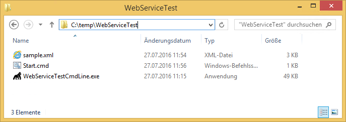

KB00002 - Testing the SIM Web Service Test Tool
================================================

.. contents:: *In this article:*
  :local:
  :depth: 1

----------

There is a command line tool which enables administrators to perform an easy test without any knowledge about HTTP web service technology.

Downloading Web Service Test Tool
++++++++++++++++++++++++++++++++++++
Please click `here <http://www.silvermonkey.net/DL/WebServiceTestCmdLine.zip>`_ to start the download.

Extracting Content
++++++++++++++++++++++++++++++++++++
Extracting the content of the ZIP:

The sample XML file will create a simple computer with one variable:

.. literalinclude:: _static/sample.xml

Editing start.cmd file 
++++++++++++++++++++++++++++++++++++
The start.cmd file is meant to be an example of how to start the web service test tool.

An example for the command line could be: 

.. code-block:: console
    
    WebServiceTestCmdLine.exe /XMLFilePath:"C:\temp\sample.xml" /WebServiceURL:"http://webserver/sim/servicelogin/service.aspx" /Var1:"01"

Running the command results in a log file written beside the EXE:

.. literalinclude:: _static/Log.txt

.. tip:: The Parameters /Var1 to /Var5 are optional and are used to replace corresponding {Var1} to {Var5} template variables in the XMLFile.