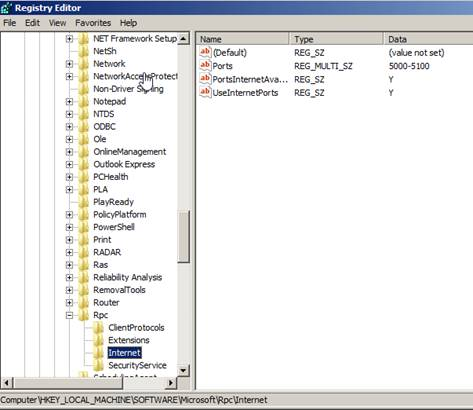
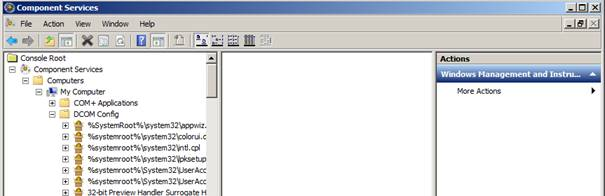
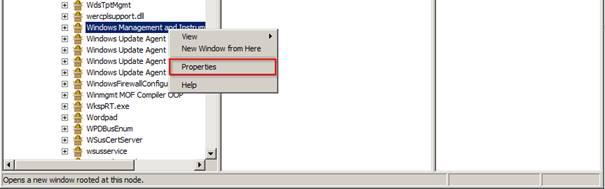

KB00003 - Determine Fixed WMI Ports
=========================================

.. contents:: Content
  :local:
  :depth: 1
.. comment  Prepare SCCM system for fixed WMI ports
            Set Dynamic Port Allocation
            Set port for Endpoint
            Change WMI mode
            Restart
            Test script

******************************************
1. Prepare SCCM System for Fixed WMI Ports
******************************************

1.1. Determine Dynamic Port Allocation
+++++++++++++++++++++++++++++++++++++
`Please click here to get the detailed  tutorial on the determination of dynamic port allocation in Windows. <http://support.microsoft.com/kb/154596/en-us>`_

.. comment Link einfügen? Meldung der Seite: Support for Windows Server '03 ended. https://support.microsoft.com/en-us/kb/154596

1.2. Determine Port for Endpoint
++++++++++++++++++++++++++++++++++++++

Launch DCOMCNFG.EXE

.. image:: _static/image005.jpg

1.3. Change WMI Mode
++++++++++++++++++++++++++++++++++++++

1.4. Restart 
++++++++++++++++++++++++++++++++++++++

1.5. Test Script
++++++++++++++++++++++++++++++++++++++

http://support.microsoft.com/kb/154596/en-us
  .. image:: _static/image001.jpg

See :download:`Download Script <_static/RPC Ports.reg>`.
 
1.2. Port für Endpoint festlegen
Starten DCOMCNFG.EXE

  

 

1.3. WMI Modus umstellen
http://msdn.microsoft.com/en-us/library/bb219447(v=VS.85).aspx

To set up a fixed port for WMI
1.	At the command prompt, type winmgmt -standalonehost
2.	Stop the WMI service by typing the command net stop "Windows Management Instrumentation"
3.	Restart the WMI service again in a new service host by typing net start "Windows Management Instrumentation"
4.	4. Establish a new port number for the WMI service by typing netsh firewall add portopening TCP 24158 WMIFixedPort

1.4. Neustart
Bitte ein Neustart des Systems durchführen
1.5. Testscript 
Im Script IP/Benutzer/Passwort eintragen

.. tip:: 
    Es kann sein, dass ein DNS Name des Servers nicht funktioniert, weil bestimmte Kerberos Ports (z.B. Port 88) gesperrt sind. In diesem Fall bitte nur die IP Adresse des Zielsystems verwenden.

Zu erwartender Rückgabewert (Es muss die Domain ausgegeben werden):
