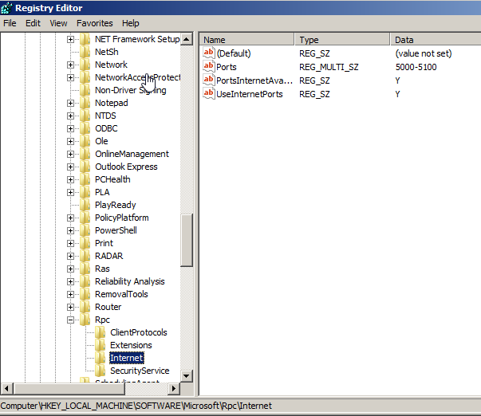
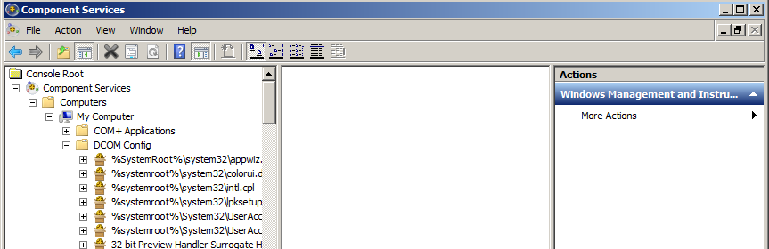
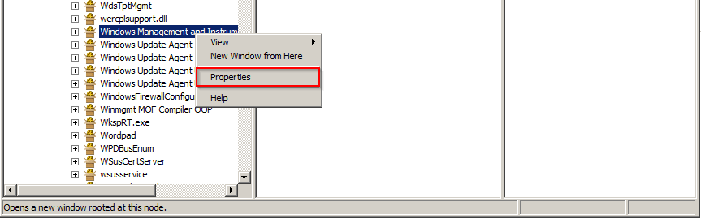
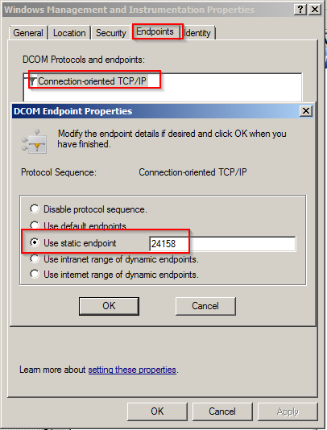

KB00003 - Setting Up Fixed WMI Ports
=========================================

.. contents:: *In this article:*
  :local:
  :depth: 1

  -------

Setting Up Dynamic Port Allocation
+++++++++++++++++++++++++++++++++++++
Please click `here <http://support.microsoft.com/kb/154596/en-us>`_ in order to access the tutorial on the determination of dynamic port allocation in Windows. 

:download:`Download script for port allocation setup <_static/RP_Ports.zip>`

Determining Port for Endpoint
++++++++++++++++++++++++++++++++++++++
Launch DCOMCNFG.EXE and follow the instructions below.

Changing WMI Mode
++++++++++++++++++++++++++++++++++++++
Please click `here <http://msdn.microsoft.com/en-us/library/bb219447(v=VS.85).aspx>`_ in order to get access to the detailed tutorial and follow the instructions on the website. 

Restart 
++++++++++++++++++++++++++++++++++++++
Please restart the system.

Test Script
++++++++++++++++++++++++++++++++++++++
Type in your IP/user/password in the script below.

:download:`Download test script <_static/WMIRemoteTest.vbs>`

.. note:: Due to eventually blocked Kerberos ports, some DNS names might not work. In this case, please use the IP adress of the target system only.

Expected return value (the domain name has to be desplayed):
   
  .. image:: _static/image005.png