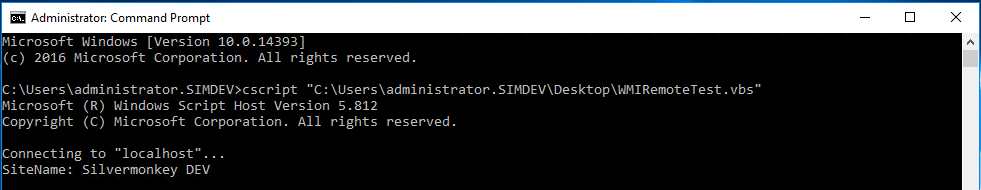

KB00003 - Setting Up Fixed WMI Ports
=========================================

.. contents:: *In this article:*
  :local:
  :depth: 1
.. comment  wie entferne ich den Punkt vor der jeweiligen Überschrift in der Content Table?

******************************************
Prepare SCCM System for Fixed WMI Ports
******************************************

1. Setting Up Dynamic Port Allocation
+++++++++++++++++++++++++++++++++++++
`Please click here in order to access the tutorial on the determination of dynamic port allocation in Windows. <http://support.microsoft.com/kb/154596/en-us>`_

.. image:: _static/image001.jpg

:download:`Download script to set up port allocation <_static/RPC_Ports.reg>`.

2. Determine Port for Endpoint
++++++++++++++++++++++++++++++++++++++

Launch DCOMCNFG.EXE.

.. image:: _static/image003.jpg
.. image:: _static/image004.jpg

3. Change WMI Mode
++++++++++++++++++++++++++++++++++++++
`Please click here in order to get access to the detailed tutorial and follow the instructions on the website. <http://msdn.microsoft.com/en-us/library/bb219447(v=VS.85).aspx>`_

4. Restart 
++++++++++++++++++++++++++++++++++++++
Please restart the system.

5. Test Script
++++++++++++++++++++++++++++++++++++++
Type in your IP/user/password in the script below.

:download:`Download test script <_static/WMIRemoteTest.vbs>`.

.. note:: Due to eventually blocked Kerberos ports, some DNS name might not work. In this case, please use the IP adress of the target system only.

Expected return value (the domain name has to be desplayed):
   
  .. image:: _static/image007.jpg