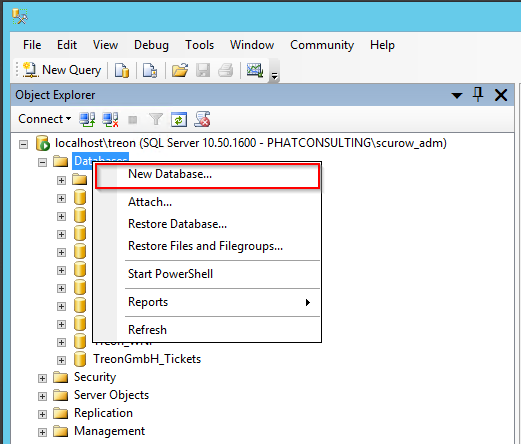
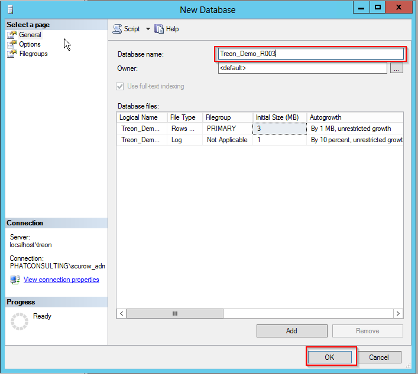

KB00004 - SIM Database Restore
=========================================

.. contents:: *In this article:*
  :local:
  :depth: 1

-------

Creating a new Database
++++++++++++++++++++++++
Connect to your SQL Server via SQL Management Studio and create a new Database:

In the following dialogue, choose a database name that fits your naming convention. Click the 'OK'-button.

Then give authorization following the installation guide.

Running Script
++++++++++++++++++++++++
Choose 'New Query': 

  .. image:: _static/image003.jpg

Copy the content of the SQL backup file that is part of the installation package and paste it into the new query window. Replace the name of the database in the 'USE {DATABASE NAME}' part of the query with the name of the database you just created.

  .. image:: _static/image004.png

After (!) this click the 'Execute' button.

You have successfully restored the SIM Database!