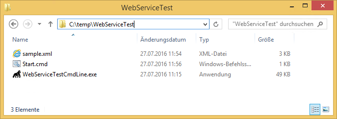

KB00004 - Web Service Test Tool
=========================================

For testing the Silver Monkey Web Service there is a command line tool which enabled administrators to perform an easy test without knowledge about working with HTTP web service technology.

1. Download Web Service Test Tool
^^^^^^^^^^^^^^^^^^^^^^^^^^^^^^^^^^^^
http://www.silvermonkey.net/DL/WebServiceTestCmdLine.zip

2. Extract content
^^^^^^^^^^^^^^^^^^^^^^^^^^^^^^^^^^^^
Extracting the content of the ZIP:

The sample XML file will create a simple computer with one variable:

  .. literalinclude:: _static/sample.xml

3. Edit Start.cmd file 
^^^^^^^^^^^^^^^^^^^^^^^^^^^^^^^^^^^^
The start.cmd file is meant to be an example how to start the web service test tool.

An example command line would be:

  .. code-block:: console
    WebServiceTestCmdLine.exe /XMLFilePath:"C:\temp\sample.xml" /WebServiceURL:"http://webserver/sim/servicelogin/service.aspx" /Var1:"01"

Running the command results in a log file written beside the EXE:

  .. literalinclude:: _static/Log.txt

.. tip:: The Parameters /Var1 to /Var5 are optional and are used to replace corresponding {Var1} to {Var5} template variables in the XMLFile