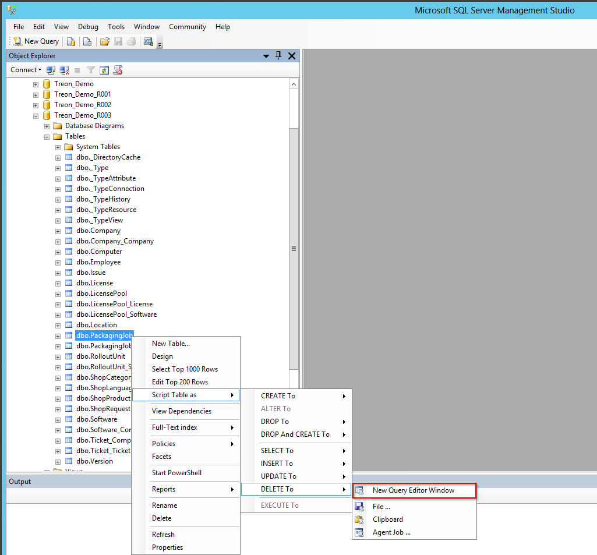
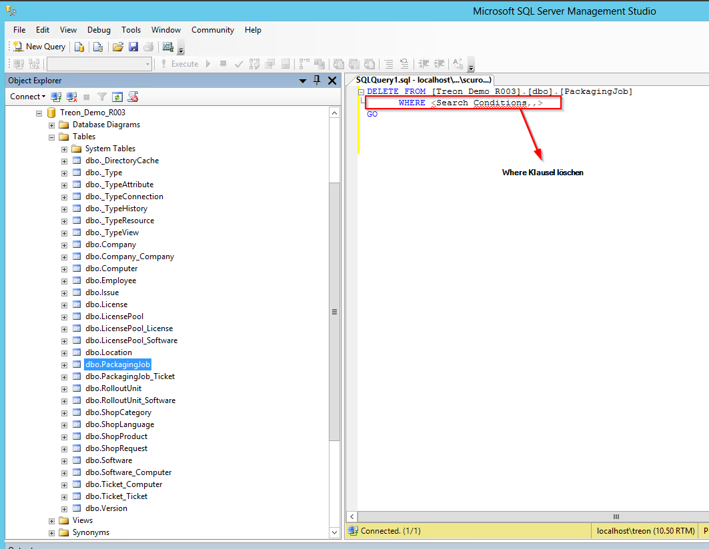

KB00005 - Reset SIM Packaging Jobs
=========================================

.. contents:: *In this article:*
  :local:
  :depth: 1

*************************************
Restore Silver Monkey Database
*************************************

Create a new Database
++++++++++++++++++++++++
Connect to your SQL Server via SQL Management Studio, create a new Database:

In the following dialogue choose a database name that fits your naming convention. Click the 'OK'-button.

Then give authorization following the installation guide.

Run Script
++++++++++++++++++++++++

Choose 'new Query': 
  .. image:: _static/image003.png

Copy the content of the SQL backup file that is part of the installation package and paste it into the new query window. Replace the database name in the 'USE {DATABASE NAME}' part of the query with the Name of the Database you just created.

  .. image:: _static/image004.png

  After (!) this click the 'Execute' button.

  You have successfully restored the SIM Database!