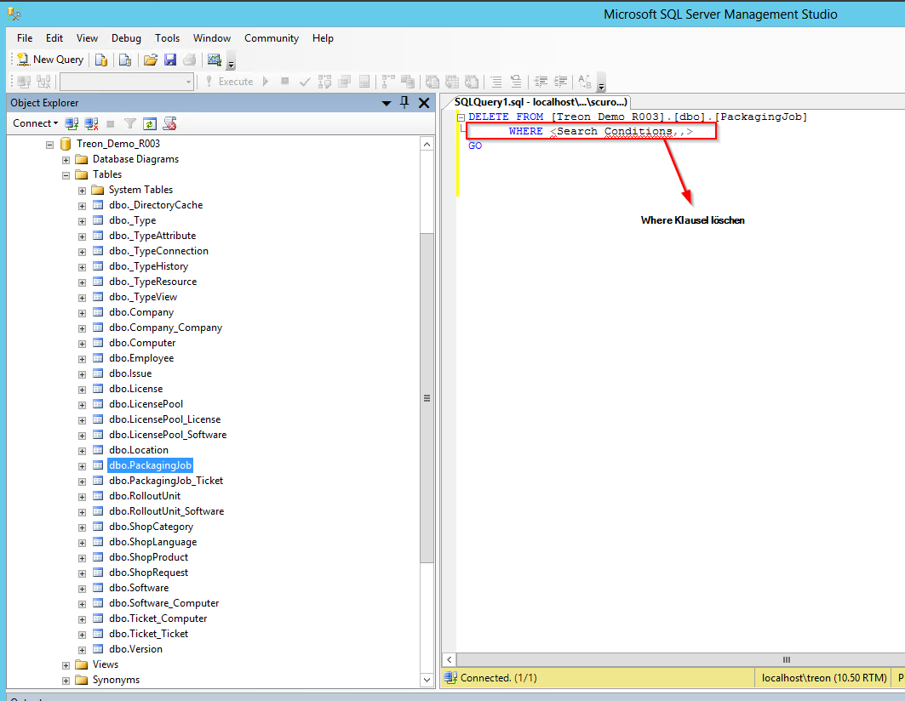
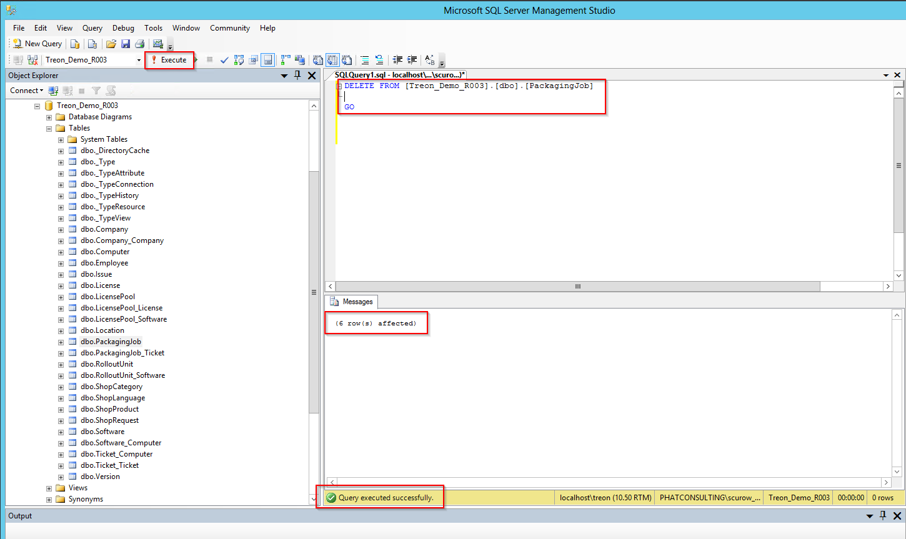
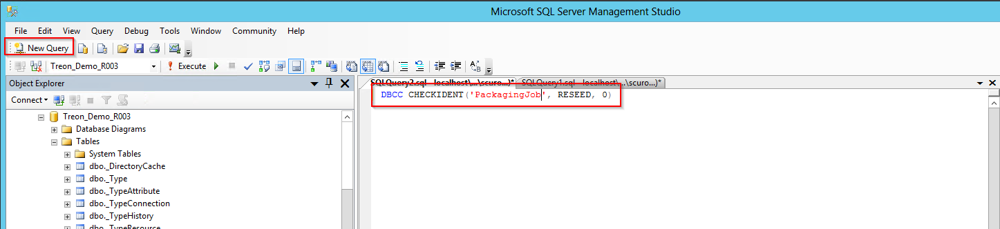
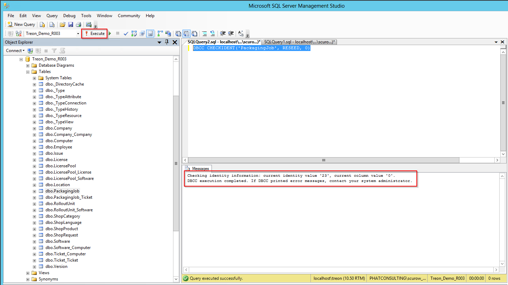

KB00005 - Resetting SIM Packaging Jobs
=========================================

.. contents:: *In this article:*
  :local:
  :depth: 1

-------

Erasing the Table of Packaging Jobs 
++++++++++++++++++++++++++++++++++

.. image:: _static/image001.png

Resetting Identity
++++++++++++++++++++++
Excecute the following command in order to make the database start the new packaging jobs with the ID number 1.

"DBCC CHECKIDENT('PackagingJob', RESEED, 0)"    (**without** quotation marks).

