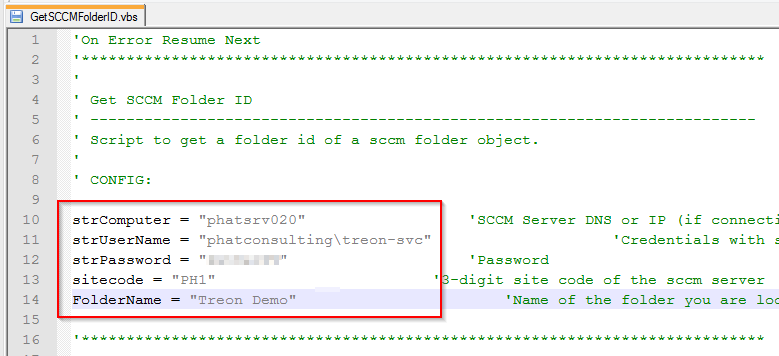
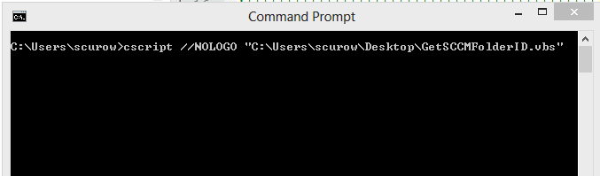
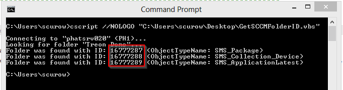

KB00006 - Establishing SCCM FolderID
=========================================

.. contents:: *In this article:*
  :local:
  :depth: 1

-------

Configurating Script
+++++++++++++++++++++++++++++++
:download:`Get SCCM FolderID - Script <_static/GetSCCMFolderID.zip>`.

A filled in form should be displayed similar to the image below:

Starting script
++++++++++++++++++++++
Open cmd.exe and read out the ID as shown in the red box below.

