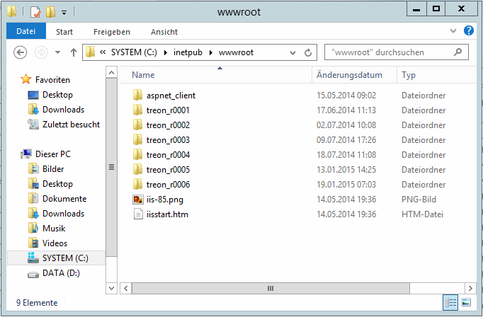
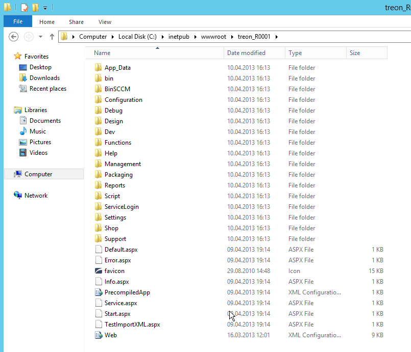

KB00007 - Creating an IIS Website for Silver Monkey
=================================================

.. contents:: *In this article:*
  :local:
  :depth: 1

-------

Copying Files to Inetpub
+++++++++++++++++++++++++++++++
Create a new folder in 

.. code-block:: console
  
      C:\inetpub\wwwroot\

Please be sure to name your file with rising numbers following the name convention
**"treon_R\**\**"** if a Silver Monkey website already exists (see image below).

Now, move the content of the Silver Monkey installation file to the folder you just created.

Creating an Application
+++++++++++++++++++++++++++
Please start MMC for IIS (Microsoft Internet Information Services). Right click on the folder and select "Add Application".

  .. image:: _static/image005.png
    :align: center

Fill in the fields displayed. The field named "Alias" should be filled with "Treon_R0001".

  .. image:: _static/image007.png
    :align: center

.. note:: Please choose the application pool named *"Treon"* or *"SIM"* if it exists.

In the next step, please authenticate the application by activating its authentication for Windows.

  .. image:: _static/image009.png
  .. image:: _static/image011.png

Setting up Writing Permission for App_data
+++++++++++++++++++++++++++++++++++
Writing permission can be set under 

  .. code-block:: console

    C:\inetpub\wwwroot\treonR0001\App_Data

  .. image:: _static/image013.png
    :align: center

Inserting Configuration.xml
+++++++++++++++++++++++++++++
Please copy the file "configuration.xml" from the former website to the new one.

  .. image:: _static/image015.png

Testing your Website
++++++++++++++++++++++++
.. note:: In case of a disabled Single Sign On, please restart Internet Explorer **before** restarting the whole server.

Open Internet explorer, then go to "http://SERVERNAME/Treon_R0001" .

Check your website version as follows:

  .. image:: _static/image017.png

  .. image:: _static/image019.png
    :align: center