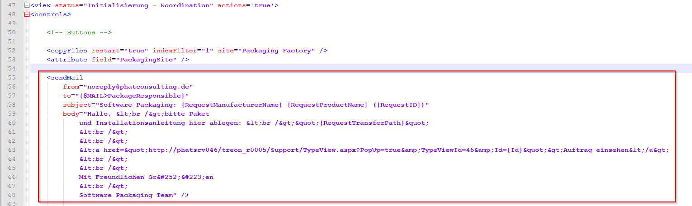
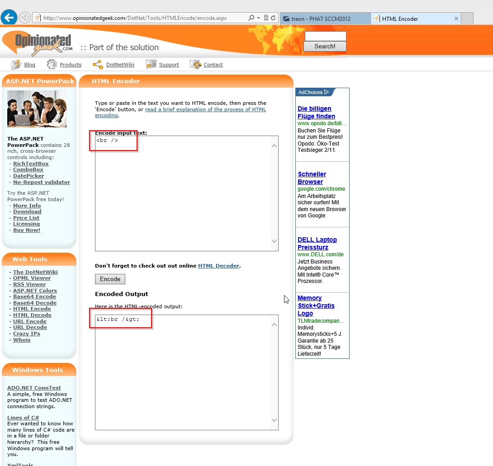

KB00008 - Sending an Email in PackWF at the Push of a Button
=============================================================

.. contents:: *In this article:*
  :local:
  :depth: 1

XML Format
+++++++++++++++++++++++++++++++

.. literalinclude:: _static/sendMail.xml
  

If you would like to use HTML in the main body as shown in the example above, you will have to encode it.
`This website <http://www.opinionatedgeek.com/DotNet/Tools/HTMLEncode/encode.aspx>`_ will facilitate your work.

For example:

