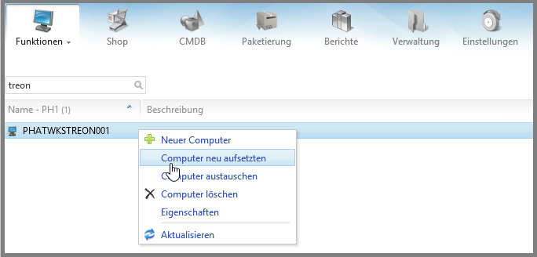
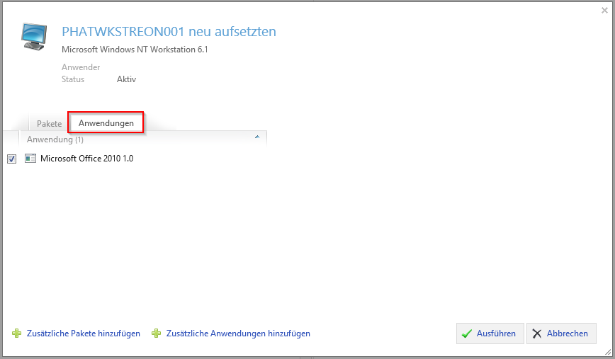

KB00009 - Computer Refresh - AdminHowTo
=============================================================

.. contents:: *In this article:*
  :local:
  :depth: 1

*****************************************
AdminHowTo: How to Refresh your Computer
*****************************************

1. Prepare Settings
+++++++++++++++++++++++++++++++
The prefix for packages and applications can be determined in the SCCM settings.

.. Note:: Packages support up to 999 variables. This is the reason for wich "###" is displayed.
Applications usually support up to 99 variables. This is why "##" is displayed in the coresponding field.

2. Computer Refresh - Examples
+++++++++++++++++++++++++++++++

Under "packages" you will find all SCCM packages which have either 
+ been announced on the computer (status is directly read out of SCCM)
or
+ have been resolved by the existing variable (packaging IDs are compared to live data in SCCM).

SCCM applications which are displayed unter "applications" are displayed the same way as SCCM packages.

As soon as the button "execute" is clicked, the existing computer object is going to be deleted in SCCM and a new one 
with the same name and MAC adress will be created. The properties of this new computer object will show a corresponding 
variable for each package and each application.

