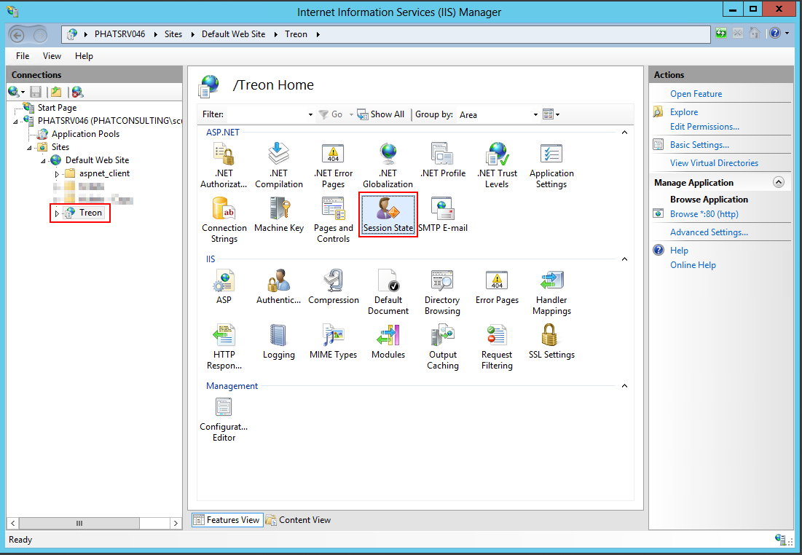
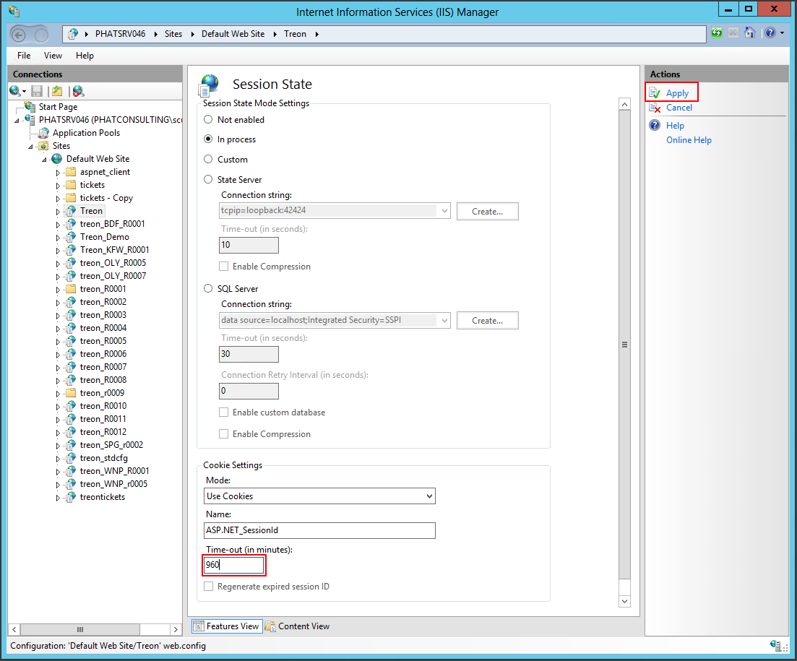

KB00010 - Adjusting the IIS IDLE Timeout
=============================================================

.. contents:: *In this article:*
  :local:
  :depth: 1

***********************************************
Adjustment of the IDLE Timeout in IIS Explained
***********************************************

Adjusting the IDLE Timeout
+++++++++++++++++++++++++++++++

First, please start the IIS Cnsole, choose the Silver Monkey Application and open the Session State Configuration.

We recommend setting a value of 960 minutes (16 hours) for the timeout:

