KB00011 - Changing IIS App Pool to Service User
=============================================================

.. contents:: *In this article:*
  :local:
  :depth: 1

-------

Creating App Pool
+++++++++++++++++++++++++++++++
Please start IIS (i.e. Internet Information Services) Console and choose the node called "Application Pools". Then perform a right-click and choose *"Add Application Pool..."*. Follow the instructions below.

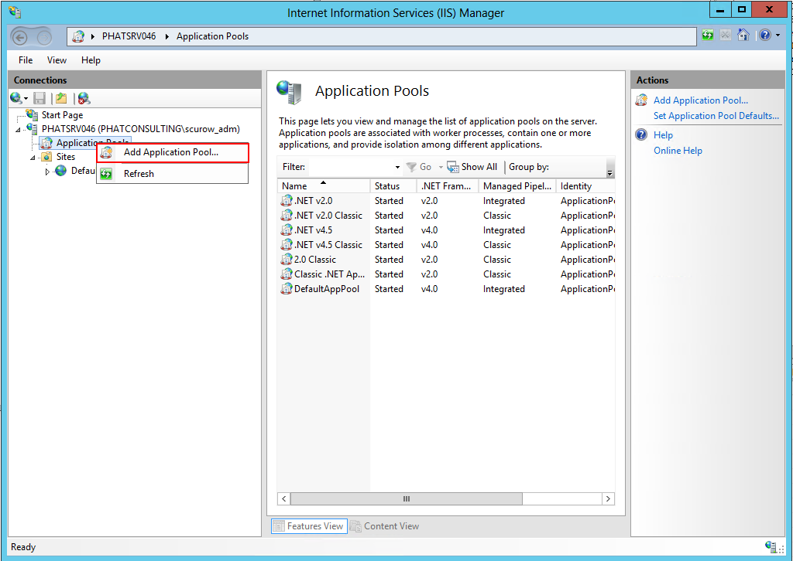

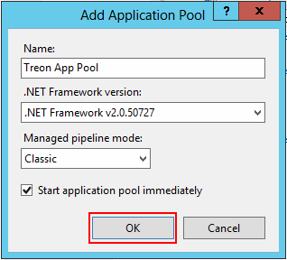

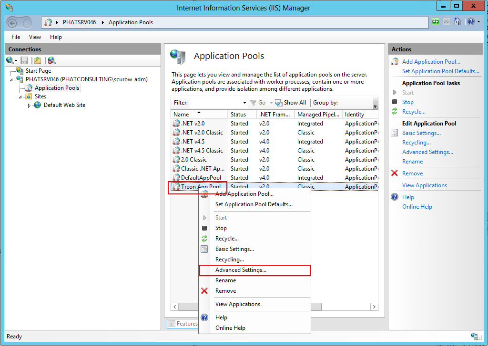

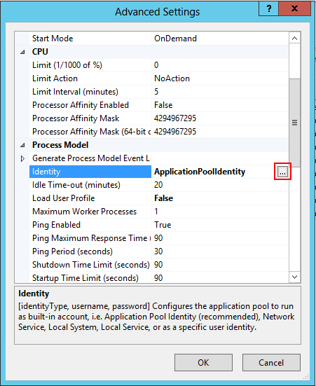

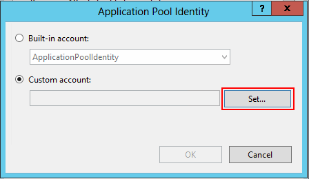
  
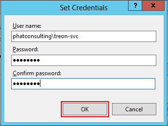

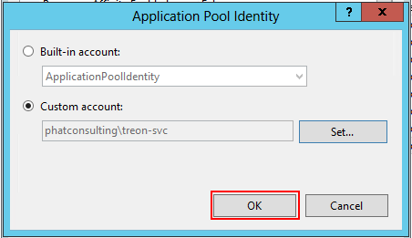
  
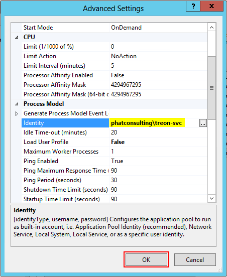
    

Connecting App Pool with the Application
++++++++++++++++++++++++++++++++++++++++++++++++
Right-click on the Application you would like to connect with...

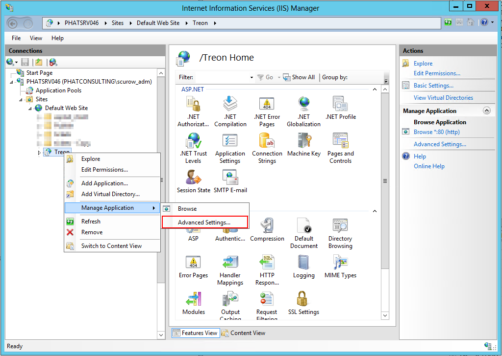

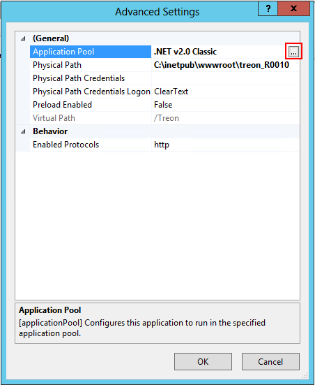

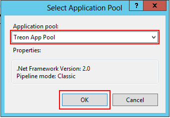

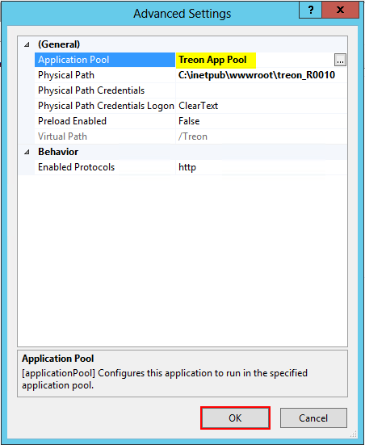
    

