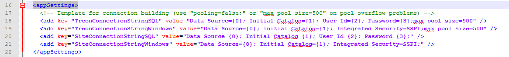
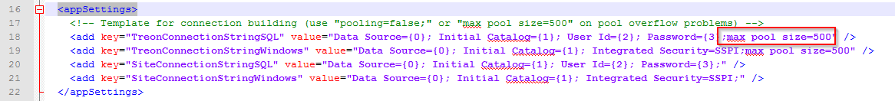

KB00012 - Full SQL Connection Pool
=============================================================

.. contents:: *In this article:*
  :local:
  :depth: 1

-------

Adjusting Web.Config
+++++++++++++++++++++++++++++++
You will find the Web.Config file in *C:\\inetpub\\wwwroot\\[TreonWesite]*.
Please open the file in a Text Editor and search for the section "<appSettings>".

Silver Monkey connects to at least two different SQL databases:

+ Its original Silvermonkey SQL database

+ The SCCM Site database

Depending on which Connection Pool fills up first, either TreonConnectionString* or SiteConnectionString* will have to be adjusted.
Especially, pay attention to the last part of the Connection String:

You will have to add the following code or rather adjust its value to "500" if it doesn't already exist in the Connection String (the value is set to "100" by default):

.. literalinclude:: _static/KB00012.xml

Both Connection Strings, \*SQL as well as \*Windows have to be changed.

For further Information about Connection String, please visit `this website <http://msdn.microsoft.com/de-de/library/system.data.sqlclient.sqlconnection.connectionstring(v=vs.110).aspx>`_ .