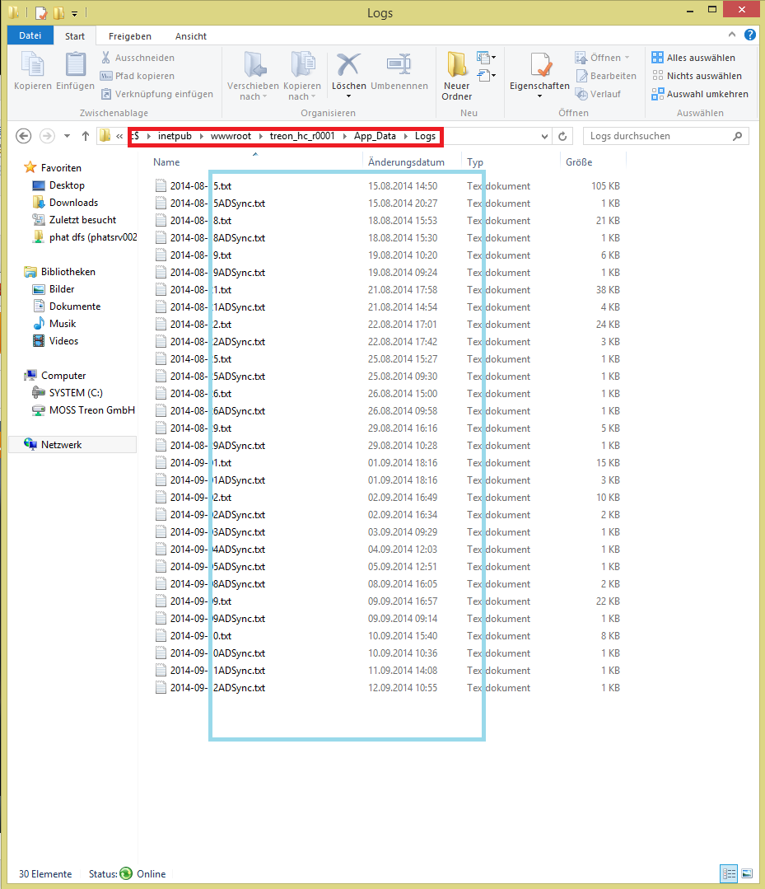
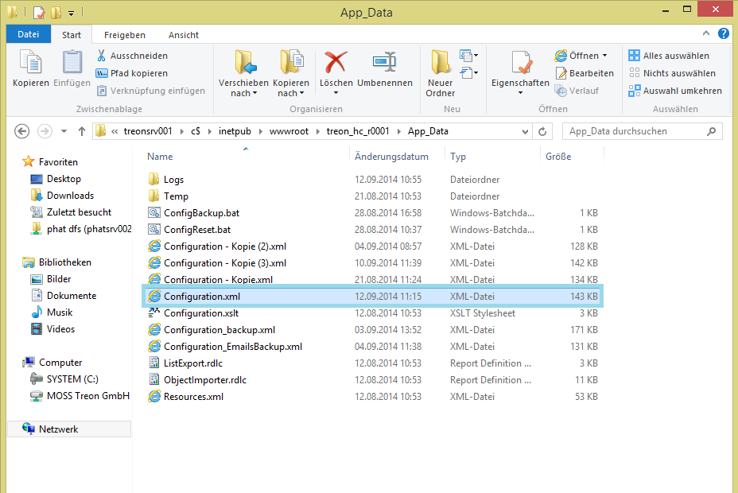

KB00014 - Finding Log Files and Configuration.xml
=============================================================

.. contents:: *In this article:*
  :local:
  :depth: 1

************************************************************************************
Finding Log Files, Configuration.xml and Taking a Screenshot of an Error Message
************************************************************************************

1. Finging Log Files
+++++++++++++++++++++++++++++++
The log files will be found in the system providing the IIS service in the following directory:
"C:\inetpub\wwwroot\treon_r****\App_Data\Logs" .

Please make copies of all log files, combine them in a .zip file and send them to support@treon.de .

2. Finding the Configuration.xml File
+++++++++++++++++++++++++++++++++++++++
Search for the Configuration.xml file in the same system in the following directory:
"C:\inetpub\wwwroot\treon_r****\App_Data"

Please equally send a copy of Configuration.xml to support@treon.de .

3. Tanking Screenshots of Error Messages
+++++++++++++++++++++++++++++++++++++++++
|We would also like to ask you to send us screenshots of error messages, problems or eventually displayed requirements. 
|Feel free to combine log files, Configuration.xml and screenshots in a single email. 
|