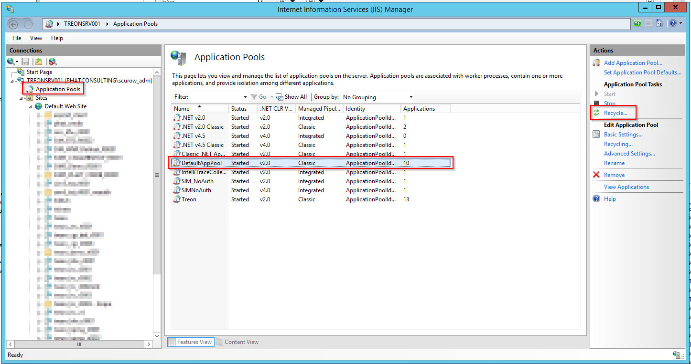

KB00016 - Reinitializing AD Sync
=========================================

.. contents:: `In this article:`
    :depth: 2
    :local:

Starting IIS Application Pool Recycle
+++++++++++++++++++++++++++++++++++++++++++
In order to discern the configurated App Pool, please follow the instruction below:

Then, start recycling:

Finding Configuration.xml
+++++++++++++++++++++++++++++++++++++++++++
Search for the Configuration.xml file in the system that delivers the IIS service in one of the following directories:

  .. code-block:: console

    C:\inetpub\wwwroot\treon_r****\App_Data
    C:\inetpub\wwwroot\sim_r****\App_Data

Resetting AD Sync Timer
+++++++++++++++++++++++++++++++++++++++++++
For example, set the value to one year in the past. Then save the file.

Starting and Checking AD Sync
+++++++++++++++++++++++++++++++++++++++++++
Please reload the Silver Monkey website in your browser by pressing the F5-key. A new AdSync log file should be created in the log directory.

