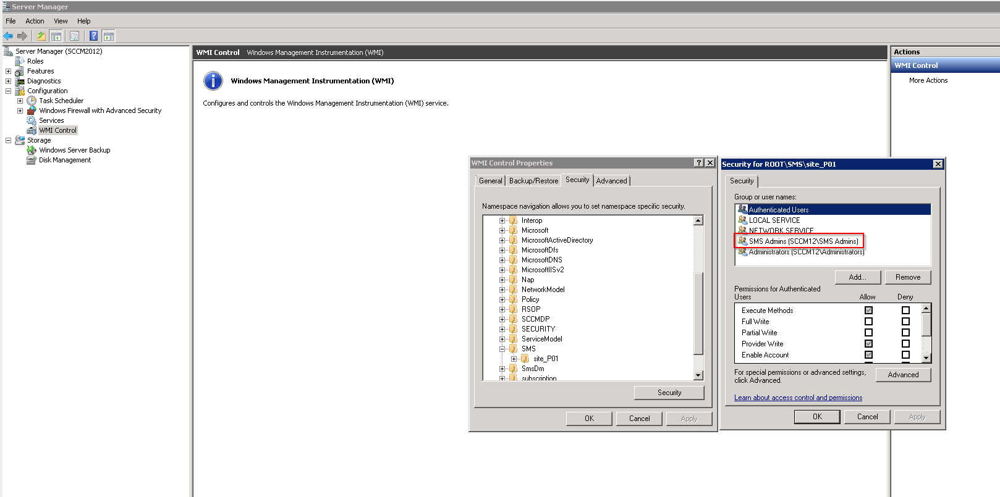
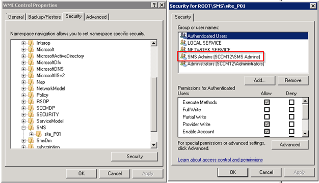

KB00022 - Known Issues
=========================================

.. figure:: _static/image001.png

   This means that the service account for SCCM has to be local admin on the SCCM server in order to set up a functioning WMI connection. 

Solve this problem by following the instructions below: 

