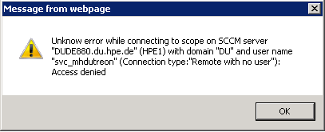

KB00022 - Known Issues
=========================================

    This means that the service account for SCCM has to be local admin on the SCCM server in order to set up a functioning WMI connection.

Instructions: 

.. image:: _static/iamge003.png

.. image:: _static/imgae005.png

