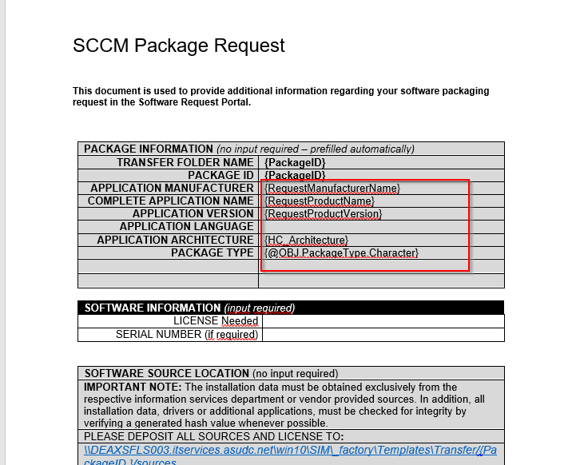
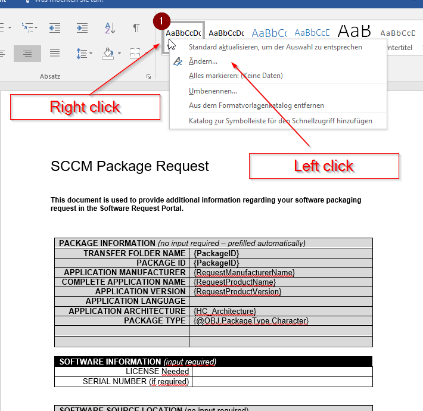
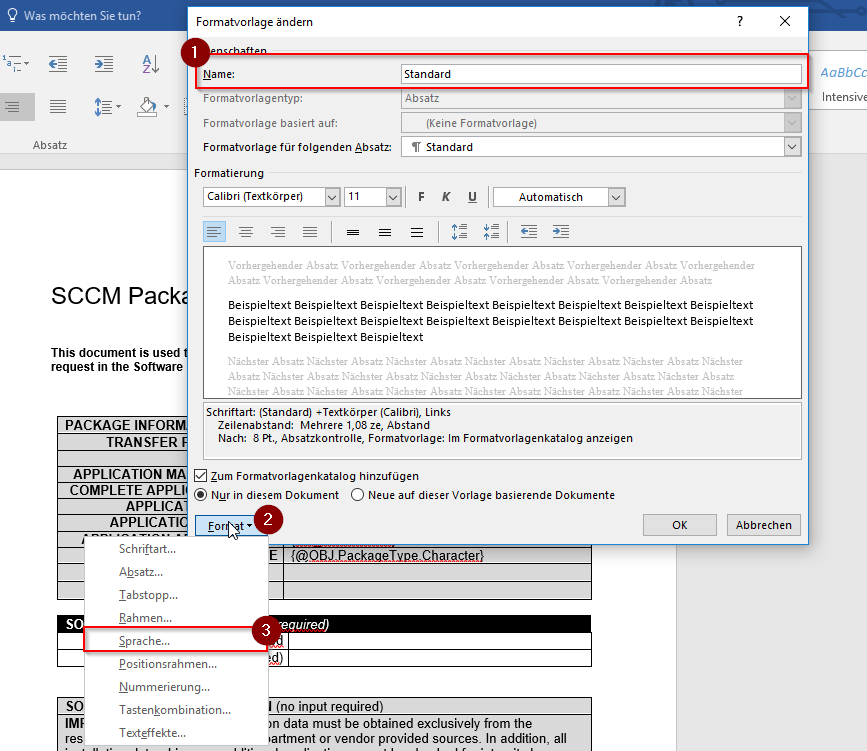
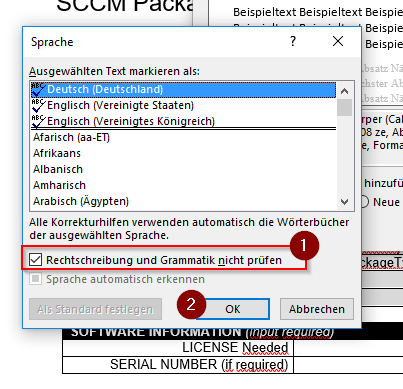

KB00023 - Copy Files fix Documentparsing
=========================================

   These curly underlinings represent the grammatical markup of Word. This markup can prevent the copyfiles function from working correctly.

Solve this problem by following the instructions below: 

