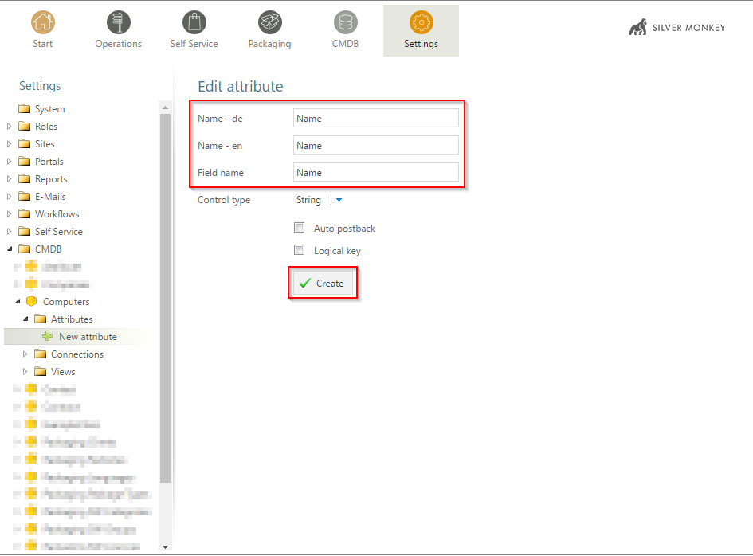

Tutorials for module "CMDB"
=============================================================

.. contents:: *In this article:*
  :local:
  :depth: 3

.. _tut-firstCMDBclass:

************************************************************************************
Creating first CMDB class
************************************************************************************

.. note:: You have to be in a role that has the right "Edit settings".

1. Go to "Settings" tab
2. Navigate to CMDB and click on the plus button at the buttom

.. image:: _static/Tutorial_FirstCMDBClass_1.png 

3. Create a new CMDB class called "Computers":

.. image:: _static/Tutorial_FirstCMDBClass_2.png 

4. Create first attributes "Name" and "MACAddress":

.. image:: _static/Tutorial_FirstCMDBClass_4.png 

5. Create an attribute of the type "Object reference" and set the reference to another custom CMDB Class "Packaging Languages" (It will be good practice for subsequent tutorial):

.. image:: _static/Tutorial_FirstCMDBClass_5.png 

6. Create a list view

.. note:: There are two different types of views: Lists and Forms. Lists display multiple elements of a CMDB Class. When clicking on an item, the configured form will be opened to view or edit the item.

.. image:: _static/Tutorial_FirstCMDBClass_7.png 

Configure the list like the following

.. image:: _static/Tutorial_FirstCMDBClass_8.png 

Two important things: 

 - The setting ``detailView="Computers Details"`` says that there is a form view with the name "Computers Details" expected
 - The setting ``cmdb2sccm="true"`` displays a transfer button in the list context menu

.. literalinclude:: _static/ViewExample2.xml
    :language: xml
    :linenos:
    :emphasize-lines: 5,11

7. Create a form view

.. _tut-massImport:

************************************************************************************
Setting up mass import for ConfigMgr
************************************************************************************

