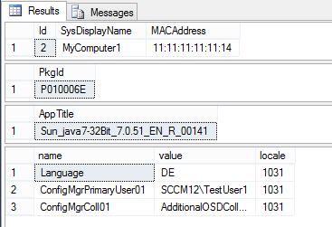

Tutorials for Module "CMDB"
=============================================================

.. contents:: *In this article:*
  :local:
  :depth: 3

.. _tut-firstCMDBclass:

************************************************************************************
Creating Your First CMDB Class
************************************************************************************

For full reference see :ref:`CMDB-actions-CMDB2SCCM`.

.. note:: You have to be able to "Edit Settings".

1. Go to the tab "Settings"
2. Navigate to CMDB and click on the plus button at the bottom

3. Create a new CMDB class called "Computers":

.. image:: _static/Tutorial_FirstCMDBClass_2.png 

4. Create your first attributes and name them "Name" and "MACAddress":

.. image:: _static/Tutorial_FirstCMDBClass_3.png 

.. image:: _static/Tutorial_FirstCMDBClass_4.png 

5. Create an attribute of the type "Object reference" and set the reference to another custom CMDB Class "Packaging Languages" (It will be good practice for the subsequent tutorial):

.. image:: _static/Tutorial_FirstCMDBClass_5.png 

.. image:: _static/Tutorial_FirstCMDBClass_6.png 

The Language class is set up as follows:

6. Set up naming rule

The setting ``name rule`` defines how the internal database column ``SysDisplayName`` is set. It contains important single column popups like the object reference chooser.  

7. Create a list view

.. note:: There are two different types of views. One is called "List" and the other one is called "Forms". Lists display multiple elements of a CMDB Class. When clicking on an item, the configured form will be opened to view or edit the item.

.. image:: _static/Tutorial_FirstCMDBClass_7.png 

Configure the list as shown:

.. image:: _static/Tutorial_FirstCMDBClass_8.png 

.. note:: 
  - The setting ``detailView="Computers Details"`` will expect a form view with the name "Computers Details"
  - The setting ``cmdb2sccm="true"`` displays a transfer button in the list context menu 
 
  .. image:: _static/Tutorial_FirstCMDBClass_8_preview.png  
 
  - For full reference see :ref:`CMDB-Lists-View`

.. literalinclude:: _static/ViewExample2.xml
    :language: xml
    :linenos:
    :emphasize-lines: 5,11

8. Create a form view

Create a new form view as shown below (you have to stick to the configured name from the list view ``detailView="Computers Details"``):

.. image:: _static/Tutorial_FirstCMDBClass_9.png

A set of attributes and form elements are automatically suggested. You can delete the ``<connections link="true" />`` line as no connections are configured in this example.

Add an action called "CMDB2SCCM" to the form. The final result of the form looks like this:

.. literalinclude:: _static/ViewFormExample1.xml
    :language: xml
    :linenos:
    :emphasize-lines: 5-9

When you go to CMDB you can have a look at the result of our list and form:

.. image:: _static/Tutorial_FirstCMDBClass_11.png

You can add more attributes to the class and use those attributes in lists and forms as you need.

.. _tut-massImport:

************************************************************************************
Setting up Mass Import for ConfigMgr
************************************************************************************

For full reference see :ref:`CMDB-actions-CMDB2SCCM`.

.. note:: This tutorial is built up on the database schema of the tutorial :ref:`tut-firstCMDBclass`.

You have to get the following information to built up an import for SCCM:

- SCCM collection **names** the computer has to be member of
- Needed computer variable names and accepted values
- Knowledge of the SIM database schema

1. Follow the manuall " :ref:`tut-firstCMDBclass` "
2. Follow the " :ref:`CMDB-SCCM-transfer` "
3. Create a dummy computer and click on "Transfer computer to SCCM"

4. First, select "Rollout unit" (usually, rollout units only make sense when importing multiple computers; the example below is simplyfied) and click on execute

5. When the action is performed in SQL level the following results will be translated by the mass import feature:

- Computer Query
- Package Query
- Application Query
- Variable Query

6. The result in SCCM looks like the following:

Variables:

Primary Users: 

Collection membership: 

