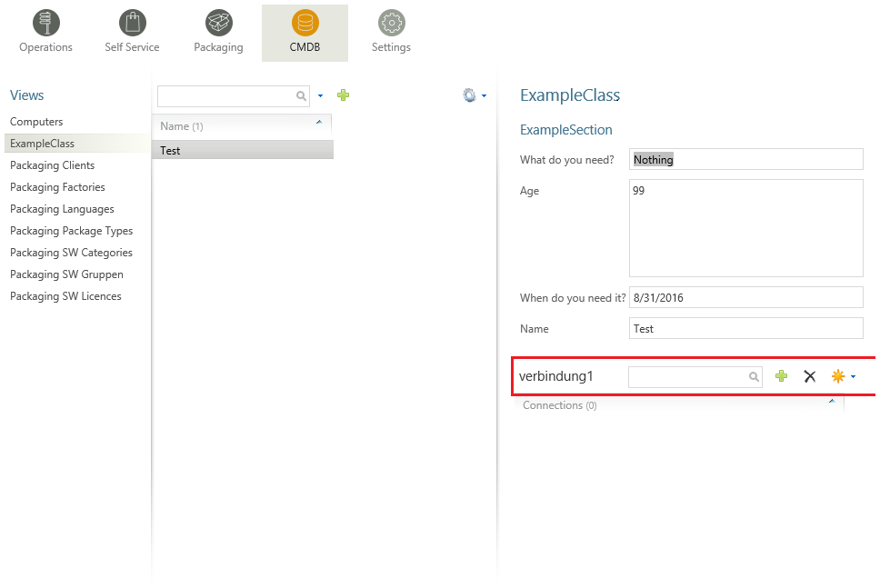

Manual for module "CMDB"
=============================================================

.. warning:: This article is under construction! Please DO NOT refer to any of the instructions below, yet!
             You may cause damage to your system! This article will be finished soon.

.. contents:: *In this article:*
  :local:
  :depth: 3

.. _CMDB-Form Views:

************************************************************************************
Form Views
************************************************************************************

===============
Form Elements
===============

Form elements are displayed in detail forms. 

Every form element has to be definded in the XML block ``<views><view><controls>``.

.. note:: In the following sections, you will finde code-blocks filled with example code. Expressions in square brackets in the tables below are placeholders.
          Please be sure to replace the example code with specific expressions for your case if you want to copy and use xml statements from this page.
          (e.g. if you want to display a widget 300 pixels wide, change *width="250"* to *width="300" **or** replace *width="[width in px]"* with *width="300"* ).

------------------
Headline
------------------

Enter the following code to display a headline:

  .. code-block:: xml
    :linenos:
    
    <views>
    <view>
    <controls>
    <headline text="ExampleClass" />

  .. figure:: _static/Headline.PNG
     
      This is how a headline is displayed in the CMBD form.
  
------------------
Section
------------------

Define a section as follows:

  .. code-block:: xml
    :linenos:

    <views>
    <view>
    <controls>
    <section text="ExampleSection" />

  .. figure:: _static/Example_Section.PNG
     
      This is how a section is displayed in the CMBD form.

------------------
Paragraph
------------------

Define a paragraph as follows:

  .. code-block:: xml
    :linenos:

    <views>
    <view>
    <controls>
    <paragraph text="This example paragraph has been created in order to test funtionality." />

  .. figure:: _static/Paragraph.PNG
      
      This is how a paragraph is displayed in the CMBD form.

------------------
Attribute
------------------

.. note:: In order to use attributes as form elements, they will have to be created first. 
          For full reference see :ref:`CMDB-Attributes`.

You can add an attribute this way:

  .. code-block:: xml
    :linenos:

    <views>
    <view>
    <controls>
    <attribute 
        field="attribute name"
        validation="*"
        readonly="false"
        width="250"
        height="50"
        setDefaultOnLoad="Name1"
        forceDefault="false"
        Comment="This is a comment."
    />

  .. figure:: _static/Attribute.PNG
       
        This is how attributes are displayed in the CMBD form.

.. csv-table:: 
   :header: "Property","Description"
   :widths: 40,58

   "field=""[string]""", "The name of the attribute according to the object definition. Optional fields can also be used. They should have a constant name."
   "validation=""[*]""", "Set up a validation rule (e.g. ""*"" is used to ask for obligatory input). Example:
      
      .. code-block:: console
        
        validation=""*""
        validation=""required: true, regexp: /^[A-Za-z\d]+$/i""
        validation=""required: true, regexp: /^[A-Za-z\d]{2,20}$/i"""
    "readonly=""[true|false]""", "Distinguishes between reading mode and writing mode. Type in ""true"" for reading mode or ""false"" if you want to enable the user to enter text."
    "width=""[width in px]""", "Width of the widget given in pixels."
    "height=""[height in px]""", "Height of the widget given in pixels."
    "setDefaultOnLoad=""[true|false]""", "Defines the default value for an empty attribute that is set when the form is loading."
    "forceDefault=""[true|false]""", "Forces implementation of the default values."
    "Comment=""[strings]""", "Add a comment to the attribute. It will be displayed when the curser is moved to the ""*"" at the end of the attribute."

------------------
Comment
------------------

You can add comments to an object in the XML file that will not be displayed when it is executed.

    .. code-block:: xml
      :linenos:

      <views>
      <view>
      <controls>
      <comment text="[Example Comment.]" />

------------------
Connections
------------------
These are connections to objects. It is possible to set up new connections or new objects.
Add connections using the following xml statement:

    .. code-block:: xml 
      :linenos:

      <views>
      <view>
      <controls>
      <connections
        width="385"
        height="200"
        id="connection1"
        title="ConnectionServer"
        filter="Software"
        link="true"
        create="view1; view2"
        readOnly="true"
      />

.. csv-table:: 
    :header: "Property","Description"
    :widths: 40,60

    "width=""[width in px]""", "Displayed width in pixels."
    "height=""[height in px]""", "Displayed height in pixels."
    "id=""[string/integer]""", "Unique label if multiple connection lists are displayed."
    "title=""[string]""", "Individual title for the connection list."
    "filter=""[type]""", "Restricts the connection list to one single object type."
    "link=""[true|false]""", "Enables opening referenced objects."
    "create=""[viewX]""", "List of object views which is supposed to be displayed when new objects are being set up and assigned."
    "readOnly=""[true|false]""", "Prevents user from setting up new connecitons if set to ""true""."

    
           This is how a connection is displayed in the CMBD form.

.. VORERST GESTRICHEN WEGEN OBSOLETHEIT.
.. ------------------
.. Link
.. ------------------
.. Include an HTML-link by using the following xml statement:

..   .. code-block:: xml
      :linenos:

..      <views>
      <view>
      <controls>
      <link
        url="http:://www.examplewebsite.com"
        label="Label1"
        icon="Name"
      />

.. .. csv-table:: 
   :header: "Property","Description"
   :widths: 40,60
  "url=""[reference]""", "Link or reference."
   "label=""[string]""", "Title of the reference (usually, the title should automatically be located)."
   "icon=""[string]""", "Name of the icon."
  
------------------
List
------------------
Display entrys of another class (e.g. table). 

    .. code-block:: xml
      :linenos:

      <list id="Resources1"
        width="1200"
        title="Resources"
        fields="Ressourcenart,110~Name,200~Prio,100~Kontakt,100~Rolle,100~Stdsatzallin,75~StdsatzAllEx,85~RKPauschale,85~LinkToProfile,200"
        count="SELECT count([RessourceId])
        FROM RessourceInRequest"
        data="
               WITH myBase AS (
               SELECT [RessourceId] ,
                  [RessourceType] ,
                  [Name] ,
                  [Prio] ,
                  [Contact] ,
                  [Role] ,
                  [Stdsatzallin] ,
                  [StdsatzAllEx] ,
                  [RKPauschale] ,
                  [LinkToProfile] ,
                  [ParentId] ,
               ROW_NUMBER() OVER (
               ORDER BY {order1}) AS POS
             FROM RessourceInRequest
             WHERE ParentId = {id}

      )

      SELECT RessourceId, RessourceType, Name, Prio, Contact, Role, Stdsatzallin, StdsatzAllEx, RKPauschale, LinkToProfile
      FROM myBase
      WHERE POS BETWEEN {start} AND {end}
      ORDER BY {order2} DESC

      "
        order1="RessourceType~Name~Prio~Contact~Role~Stdsatzallin~StdsatzAllEx~RKPauschale~LinkToProfile"
        order2="RessourceType~Name~Prio~Contact~Role~Stdsatzallin~StdsatzAllEx~RKPauschale~LinkToProfile"
        view="Ressourcen Details (2. Schritt)"
        cmd="javascript: try {window.parent.gridTable.clearSelection();} catch (e){} try {window.opener.gridTable.clearSelection();} catch (e){} document.location.href='TypeView.aspx?PopUp=true&amp;TypeViewId={view}&amp;Id='+id" />

.. .. csv-table:: 
   :header: "Property","Description"
   :widths: 40,60

..  "url", "Link or reference."
   "label", "Title of the reference (usually, the title should automatically be located)."
   "icon", "Name of the icon."

===============
Action Buttons
===============

Action buttons are buttons in detail forms. When a user has writing permission for the specific step he / she can click on that button. Action buttons are displayed on the right side of every detail form as the following image shows: 

  .. image:: _static/ActionButtonsOverview.png

Every action button has to be definded within a view in the XML block ``<views><view><controls>``. Please see the following example:

.. literalinclude:: _static/ViewExample.xml
    :language: xml
    :linenos:
    :emphasize-lines: 6

------------------
Execute
------------------

Execution of a commandline or a script. The process will be executed in the context of the IIS application pool.
However, you can use in the script impersonation for using specific accounts.

 .. code-block:: xml 
  :linenos:

   <execute   
      title="Title of the button" 
      command="C:\windows\system32\cmd.exe"
      arguments="{Var1} {Var2} {Var3}"
      exit_1="Execution was sucessfully processed."
      exit_2="Error while execution. See log for details."
      wait="true" 
   />

**Available attributes**

.. csv-table:: 
   :header: "Attribute","Description"
   :widths: 40,60

   "title=""[Resource]""", "Title of the button"
   "command=""[PathToExe]""", "Full path to the executable file. Environment variables are not supported."
   "arguments=""[{Var1} {Var2} {Var3}]""", "Arguments passed to the executed process."
   "exit_nn=""[Resource]""", "After execution the exit code will be passed to the website. If a corresponding exit_nn parameter is set, a pop up is displayed to the user."
   "wait=""[true|false]""", "If set to true, the website waits for the execution to end."

.. warning:: If "wait" is set to "true" be aware that the internet browser and the IIS session itself both have an IDLE timeout. Only use wait="true" if the script is executed within seconds.  

**Examples:**

1. Executing a batch file

 .. code-block:: xml 
  :linenos:

   <execute   
      title="My CMD Script" 
      command="C:\windows\system32\cmd.exe"
      arguments="/C C:\SilverMonkey\Scripts\MyFirstscript.cmd {ID}"
      wait="false" 
   />

.. note:: You can also execute scripts from a network path. Make sure that the IIS Application Pool is configured to use a specific service account (default is LOCALSYSTEM).

.. code-block:: xml 
  :linenos:

   <execute   
      title="My CMD Script" 
      command="C:\windows\system32\cmd.exe"
      arguments="/C \\networkpath\share\scripts\myscript.cmd {ID}"
      wait="false" 
   />

2. Executing a powershell PS1 script

.. code-block:: xml 
  :linenos:

   <execute   
      title="My PS1 Script" 
      command="C:\Windows\system32\WindowsPowerShell\v1.0\powershell.exe"
      arguments="C:\SilverMonkey\Scripts\MyFirstscript.ps1 -PackagingJobId {ID} -OtherParam &quot;{Var1}&quot;"
      wait="false" 
   />

.. tip:: Using quations within XML attributes: *&quot;{Var1}&quot;* (HTML notation).

`CMDB-actions-CMDB2SCCM`_

------------------
ExecutePS
------------------

.. warning:: This function is deprecated because it only supports powershell up to version 2.0 and does not support cmdlets.

.. code-block:: xml 
  :linenos:

   <executePS   
      title="My PS1 Script" 
      command="C:\SilverMonkey\Scripts\MyFirstscript.ps1"
      arguments="[-PackagingJobId {ID} -OtherParam &quot;{Var1}&quot;]"
      wait="false" 
   />

.. note::  The "return" command gives back a value from the PowerShell script to the form. In the example, the value "PSVarialbe $ComputerSID" is given back to the field "ComputerSID" in the current class.
          ``return "ComputerSID = “+"'"+$ComputerSID+"'"``

.. csv-table:: 
   :header: "Attribute","Description"
   :widths: 40,60

   "title=""[string]""", "Text in the head of the function."
   "command=""[command line]""", "Command line (solved against the corresponding data record."
   arguments=""[string]""", "Arguments that call the command (solved against the corresponding data record). If arguments are supposed to be given to the PS script, put a hyphen before the value that you want to forward."
   "wait=""[true|false]""", "Waits for the execution to stop (in case of synchronous execution). Only if this value is set to ""true"" the system can send a report to the user."

------------------
CMDB2SCCM
------------------

Creates or edits one or more computer objects in Microsoft ConfigMgr and performs additional actions regarding the systems:

  - Adding variables
  - Creating direct memberships for ConfigMgr Collections

The underlying code can be used in two methods:

 a) Via mass import button in lists
 b) Via action button in forms

.. note:: This action button was orignally used to fully import systems (mass import). By defining the CMDB mass import configuration to accept single systems by parameter also single systems can be imported.

- See :ref:`tut-massImport` for tutorial.
- See CMDB-SCCM-transfer_. for more information.

.. code-block:: xml 
  :linenos:

  <CMDB2SCCM   
      title="Title of button" 
      param="String"
      restart="true"
   />

**Available Attributes**

.. csv-table:: 
   :header: "Attribute","Description"
   :widths: 40,60

   "title=""[resource]""", "Title of the button"
   "param=""[string]""", "String to pass to the SQL scripts executed on runtime of the mass import."
   "restart=""[true|false]""", "If set to false, the button will be invisible when executed once."

**Example:**

+ Executing a batch file

.. code-block:: xml 
  :linenos:

  <CMDB2SCCM   
    title="Transfer Computer to SCCM" 
    param="SingleTransfer"
    restart="true"
  />

------------------
CopyFiles
------------------
Opens a dialogue in which new directory structures can be set for the packaging workflow. 
(Copy is carried out in context of the background SCCM account.)

  .. code-block:: xml
    :linenos:

    <views>
    <view>
    <controls>
    <copyFiles
      restart="true"
      site="Packaging site name" 
      indexFilter="true"
      indexFilterPreselected="false"
      title="Title"
      Validation="*"
    />

.. csv-table:: 
   :header: "Attribute","Description"
   :widths: 40,60

   "restart=""[true/false]""", "Enables repetition of the proces after the package has been created (e.g. in order to recreate the package after manual deletion."
   "site=""[Packaging site Name]""", "Defines on which packaging site the operation will be carried out. If this attribute is not set, a parameter type ""Packetierungssite" has to contain the information needed."
   "indexFilter=""[true|false]""", "Enables the imposal of a copying restriction if multiple processes are defined."
   "indexFilterPreselected=""[true/false]""", "Enables preselection of different check boxes."
   "title=""[String]""", "Enables the possibility to change the name of the button."
   "validation=""[*]""", "Validation rule. If the validation rule is activated, you have to execute this CopyFiles-Operation in order to proceed to the next workflow step."

------------------
CreatePackage
------------------
Opens a dialogue in which you can compile the SCCM package for the packaging workflow. 

  .. code-block:: xml
    :linenos:

    <views>
    <view>
    <controls>
    <createPackage
      restart="true|false"
      site="Packaging site name"
      sendToDP="true|false"
    />

 .. csv-table::
    :header: "Attribute","Description"
    :widths: 40,60

    "restart=""[true/false]""", "Enables repetition of the proces after the package has been created (e.g. in order to recreate the package after manual deletion)."
    "site=""[Packaging site Name]""", "Defines on which packaging site the operation is to be carried out. If this attribute is not set, a parameter type ""Packetierungssite"" has to contain the information needed."
    "sendToDP=""[true|false]""", "Enables transmission to Distribution Points (""DP"")."

------------------
CreateCollection
------------------
Opens a dialogue to create a new collection for the packaging workflow.

  .. code-block:: xml
    :linenos:

    <views>
    <view>
    <controls>
    <createCollection
      title="Ressource"
      folder="OrderId"
      parentCollection="CollectionId"
      name="Namensregel"
      collectionType="Typ"
      limitToCollectionId="CollectionId"
      query="Regelabfrage"
    />

.. csv-table:: 
   :header: "Attribute","Description"
   :widths: 40,60

   "title=""[string]""", "Text of the header of the function."
   "folder=""[string / integer]""", "Optional declaration of hte folder in which the collection is supposed to be compiled (from SCCM 2012). Note the ID of the folder - its name will not be deleted. A whole folder tree can optionally be set here. In this case, enter the ID of the folder an all folder names that should be set and connect them with a tilde. Example: 16777222~{Manufacturer}~{Product}~Install "
   "parentCollection=""[string / interger]""", "Optionally declare the collection in which the new collection is supposed to be saved (SCCM 2007)."
   "name=""[string]""", "Set a naming convention or the new collection."
   "collectionType=""[integer]""", "Collection-type key (1: user, 2: computer)."
   "limitToCollectionId=""[string]""", "Limited collection for SCCM 2012."
   "query=""[string]""", "Query for dynamic collections."

------------------
CreateApplication
------------------
Opens a dialogue in which you can set up the SCCM Application for the packaging workflow.

  .. code-block:: xml 
    :linenos:

    <views>
    <view>
    <controls>
    <createApplication
      restart="true|false"
      title="Resource"
      titleRestart="Resource"
      site="Packaging site name"
      configuration="Name"
    />

 .. csv-table:: 
   :header: "Attribute","Description"
   :widths: 40,60

   "restart=""[true|false]""", "Enables repetition of the proces after the package has been created (e.g. in order to recreate the package after manual deletion."
   "title=""[string]""", "Name of the resource of the action button for initial creation of the application. (The corresponding text resource has to be defined in *Ressources.xml*.)"
   "titleRestart=""[string]""", "Name of the resource of the action button for recreation of the application."
   "site=""[string]""", "Defines the packaging site where the operation has to be carried out. If this attribute is not set, the packaging job has to contain a parameter type ""packaging site"" in order to recieve the needed information."
   "configuration=""[string]""", "Name of the configuration for the application from the site settings."
   
------------------
Comment
------------------
Shows the possibility to enter a comment. All comments will be historicized.

.. code-block:: xml
  :linenos:

  <views>
  <view>
  <controls>
  <comment="This comment and will be historicized." />

------------------
Save
------------------
In order to display a save-button, enter the following XML code:

.. code-block:: xml
  :linenos:

  <views>
  <view>
  <controls>
  <save
    delete="true|false"
  />

.. csv-table:: 
   :header: "Attribute","Description"
   :widths: 40,60
   :align: center

   "delete=""[true|false]""", "Add a delete-button."

------------------
SendMail
------------------
Use the following XML statements in order to show a function to send preformatted Emails.

.. code-block:: xml
  :linenos:
  
  <views>
  <view>
  <controls>
  <sendMail
    title="Welcome to SIM"
    from="support@silvermonkey.net"
    to="exampleclient@example.com"
    subject="Text"
    body="Lorem ipsum dolor."
    mailGroup="AllClients"
  />

.. csv-table:: 
   :header: "Attribute","Description"
   :widths: 40,60

   "title=""[string]""", "Optionally declare a title to the button."
   "from=""[mail address]""", "Sender's mail address."
   "to=""[mail address]""", "Recipient's mail address(es)."
   "subject=""[string]""", "Subject of the email."
   "body=""[string]""", "Body of the email."
   "mailGroup=""[string]""", "Instead of adding the attributes ""to"", ""subject"" and ""body"" you can refer to a predefined group. This simplifies simultaneously sending multiple mails."

------------------
ImportXML
------------------

.. code-block:: xml
  :linenos:

  <views>
  <view>
  <controls>
  <importXML
    title="Resource"
    titleRestart="Resource"
  />

 
 .. csv-table:: 
   :header: "Attribute","Description"
   :widths: 40,60

   "title=""[string]""", "Resource name of the action button."
   "titleRestart=""[string]""", "Resource name of the action button which has to be used when the application is recreated (only when restart=""true""). The corresponding text resource has to be defined in Ressources.xml."
   

----------------------
CreateActiveDirectory
----------------------
Creates an active directory object. The active directory will be authenticated with the Windows login data for your *treon* database.
This is also the case if database authentication is set to "SQL". 

.. code-block:: xml
    :linenos:

    <views>
    <view>
    <controls>
    <createActiveDirectory
      title="Active D"
      parentLDAP="Ldap path"
      class="SchemaClassName"
      name="naming convention"
      attribute="value"
    />

.. note:: You will have to outcode special characters when declaring the parentLDAP. This means a backslash will have to be put in front of commas, backslashes, the rhombus sign, 
          the plus sign, angle brackets, semicolons, quotation marks and the equal sign.

.. csv-table:: 
   :header: "Attribute","Description"
   :widths: 40,60

   "title=""[string]""", "Title of the action button."
   "parentLDAP=""[LDAP path]""", "LDAP path of the container in which the object is supposed to be created."
   "class=""[string]""", "Schema class of the object that is created."
   "name=""[string]""", "Naming convention for the new object."
   "attribute=""[value]""", "All further attributes are interpreted as object attributes and connected to the first object."

.. _CMDB-LIst Views:

************************************************************************************
List Views
************************************************************************************

You can create custom lists and customize them to fit your needs. The following subchapters describe the options you have when you are creating or customizing a list. 

===================
Properties
===================

.. csv-table:: 
   :header: "Property","Description"
   :widths: 40,80

   "Design", "Choose initially between list and form."
   "Name - de / Name - en", "The displayed name of the list"
   "Sort order", "Choose where to display the chosen list in the dropdown menu."
   "Roles", "Choose wich roles can see the list."
   "Definition", "The definition of the list."

Example List:

 .. code-block:: xml 

   <view splitterWidth="550" 
            detailView="Paketdetails PackWF" 
            newLink="" 
            viewPane="false" 
            refresh="true" 
            excelExport="true" 
            importExport="false"
            popUp="1100,800"> 

   <columns>
        <column field="ClientCode"  width="70" />
        <column field="RequestID"  width="70" />
        <column field="RequestReference"  width="70" />
        <column field="SysStatus"  width="180" />
        <column field="RequestManufacturerName"  width="200" />
        <column field="RequestProductName"  width="200" />
        <column field="RequestProductVersion"  width="100" />
        <column field="PackagingPackageName"  width="-1" />
        <column field="PackageSWGroups"  width="200" />
   </columns>

   <data>
        <condition> ({search}='' OR PackageProductName like {search} OR ClientCode like {search} OR RequestReference like {search} OR RequestID like {search}) </condition>
   </data>
   </view>

.. _CMDB-Lists-View:

======================================
   <view> Definition
======================================

**Parameters**

.. csv-table::
   :header: "View Options","Description"
   :widths: 40,80

   "splitterWidth", "Width of the splitter shown in list form. (in pixels)"
   "detailView- de / Name - en", "Specifies the form name that is to be used for the detailed representation of a list form."
   "newLink", "Construction of new objects in a list. The “detailed view“ is used as detail form."
   "viewPane", "If this value is set to “false“, the selection is displayed as a drop-down list."
   "refresh", "Displays the update function in the list view."
   "excelExport", "Displays the excel export function in the list view."
   "importExport", "Displays the import/export function in the list view."
   "popUp", "By specifying a pop-up window size in the format “width, height“ (in px), a list view opens choosen entries in a new window e.g .: “800,600“"

======================================
   <columns> Definition
======================================

Columns represent Attributes and are used to display their values in a list. You can see the syntax in the following code-block.

.. csv-table::
   :header: "Column Options","Description"
   :widths: 40,80

   "Column field", "The fieldname of the attribute to be displayed."
   "width", "Width of the column in px."

======================================
   <data> Definition
======================================

In the <data> section you can define the initial search condition for the displayed list objects. You can also define in which attributes to search.

The highlighted part in the following code block causes the website to display just the entries that posses a value like 'john doe' in the attributes IssueEditor, Requestor or qualityinspector.

 .. code-block:: xml 
   :emphasize-lines: 4

   <condition>
      ({search}='' OR IssueID like {search} OR Title like {search})
   AND 
      (IssueEditor like '%John Doe%' OR Requestor like '%John Doe%' OR qualityinspector like '%John Doe%')
   </condition>

The next highlighted part in the code block defines that the list search associated with that list will search in the attributes IssueID or Title.

 .. code-block:: xml 
   :emphasize-lines: 2

   <condition>
      ({search}='' OR IssueID like {search} OR Title like {search})
   AND 
      (IssueEditor like '%John Doe%' OR Requestor like '%John Doe%' OR qualityinspector like '%John Doe%')
   </condition>

You can define very specific filters and conditions with TSQL in lists. 

.. _CMDB-Attributes:

************************************************************************************
Attributes
************************************************************************************

**Different Types of Attributes**

You can create different types of attributes to customize the form to your needs. These attributes have different settings and functions which are described in the two tables below.

.. csv-table::
   :header: "Attribute Type","Description", "Additional Options"
   :widths: 40,40,40

   "String", "Field that holds a text.", "Default Value, Input mask"
   "Date", "Field that holds a date.", "Default Value, Number Format"
   "Integer", "Field that holds an integer.", "Default Value, Number Format"
   "Big integer", "Field that holds a big integer.", "Default Value, Number Format"
   "Float", "Field that holds a float.", "Default Value, Number Format"
   "Multilanguage Text", "-- Deprecated -- ", "-- Deprecated -- "
   "Checkbox", "Field that displays a checkbox, can have the Status 'checked' or 'unchecked'.", "Default value, Input mask"
   "Data list", "Field that holds a fixed list of entrys that can be defined in the GUI, the entrys are seperated with a semicolon ('firstentry;secondentry').", "Items, Default Value, Fill stage"
   "Config. list", "-- Deprecated --", "-- Deprecated --"
   "SQL list", "-- Deprecated --", "-- Deprecated --"
   "File", "Contains files that are stored in the SQL Database.", "Default value, Input mask"
   "Object reference", "Field that references to another table and displays the entrys defined in it.", "Object reference, Filter, Default value"
   "Active Directory User", "Field that prevents users from being registered in the Active Directory Cache (the cashe is located in the SIM DB).", "LDAP path, Default value"
   "Active Directory Group", "Field that prevents groups from being registered in the Active Directory Cashe (the cashe is located in the SIM DB).", "LDAP path, Default"
   "Packaging package name", "-- Deprecated --", "-- Deprecated --"
   "Packaging operation system", "-- Deprecated --", "-- Deprecated --"
   "Packaging site", "-- Deprecated --", "-- Deprecated --"

**Extended Attribute Functions/Options**

.. csv-table:: 
   :header: "Function","Description"
   :widths: 40,80

   "Name - de / Name - en", "The Displayname of the attribute."
   "Field name", "This is the actual column name in the SIM SQL DB."
   "Database Type", "Describes the attributes type."
   "LDAP path", "LADP path for the AD Users/Groups."
   "Auto Postback", "-- Feature not used --"
   "Suggestion", "Autocomplete. If suggestions are enabled, recent entrys will be suggested."
   "Default value","Defines a default value that will be set automatically."
   "Logical Key", "-- Feature not used --"
   "Input mask","Specifies the required format of the entry. Example: \*\*-\*\*-\*\*-\*\*-\*\*-\*\* (for MAC-Adresses) '*' is a placeholder. A valid entry would be 11-11-11-11-11-11."
   "Number format", "Defines the required format of every entry. Example: „#,##0.0“ „DD.MM.YYYY“"
   "Items", "Items of a data list seperated by semicolons. Example: Yes;No;(choose)"
   "Fill stage", "-- Feature not used --"
   "Object reference", "Used for Object reference attributes. Choose the table you want to refer to."
   "Filter", "Used for object reference attributes. Filter the entrys in the table you are referring to."
   "LDAP path", "LADP path for the AD Users/Groups."

.. _CMDB-SCCM-transfer:

************************************************************************************
SCCM Transfer
************************************************************************************

The SCCM transfer module is basically a collection of SQL queries which are executed and delivered to SCCM. This way, customers can fully change the behaviour to their needs.
In general SCCM transfer can be configured in two different modes:

a) Single computer transfer (used by form action button)
b) Multiple computer transfer (used by list action button)

You will find the configuration for SCCM trensfer in "Settings->CMDB".

.. csv-table:: 
   :header: "Function","Description"
   :widths: 40,80

   "Description (de/en)", "Info text displayed in the pop-up."
   "List query", "Query which builds up the dropdown list in the pop-up."
   "Computer query", "Selects mandatory data for computer import. 
   It is important to stick to the correct order of the selected attributes:

    1. = Unique ID of computer element in SIM database
    2. = Target computer name
    3. = MAC Address
    4. = SMBIOS GUID (if available the computer will be created with SMBIOSGUID rather that MAC Address)

   Available variables:

    - ""{0}"" = Selected (computer) item database IDs in the popup.
    - ""{roles}"" = Roles the user is currently in.
    - ""{user}"" = Username of the user currently logged in (DOMAIN\Username).
    - ""{id}"" = ID of the CMDB item. **Note**: Only available when opened via action button.
    - ""{param}"" = Additional parameters defined in the view. Note: Only available when opened via action button.

   "
   "Variable query", "Variables added to the created SCCM computer object.
   It is important to stick to the correct order of the selected attributes:

    1. = Name of the computervariable
    2. = Value of the computervariable
    3. = Locale of the computervariable (if unknown please use '1031')

   Available variables:

    - ""{0}"" = SIM DB ID of the transferred computer object.
    - ""{param}"" = Parameter string given by the corresponding action button parameter.

   Special variable prefixes:

    - ""ConfigMgrColl"" = If the variable has this prefix, a direct membership will be created for the collection **name**.
    - ""ConfigMgrPrimaryUser"" = If the variable has this prefix, a primary user relationship will be created (``DOMAIN\Username`` notation).
   
   "
   "Software query", "Variable SCCM **package** list created at runtime and added as variables to the computer object."
   "Application query", "Variable SCCM **application** list created at runtime and added as variables to the computer object."
   "Computer update", "SQL script which is executed for every transfered computer with import result.
   Available variables:

    - ""{0}"" = SIM DB ID of the transfered computer object.
    - ""{1}"" = Message of the result. If successful the message is empty.

   "
   "Site", "Target SCCM site object (Settings->Sites)."
   "Configuration", "Computer configuration (variables, collections) which is the base for the creation of a new computer object."

  

.. _CMDB-Single-computer-transfer:
======================================
Single Computer Transfer Example
======================================

Exchange the following XML with the corresponding elements in your configuration.xml:

.. literalinclude:: _static/ExampleSingleComputerTransfer.xml
    :language: xml
    :emphasize-lines: 1

.. warning:: After import, make sure you have "Site" and "Configuration" configured correctly in Settings -> CMDB.

.. _CMDB-Multiple-computer-transfer:
======================================
Multiple computer transfer example
======================================

Content will be published soon.
