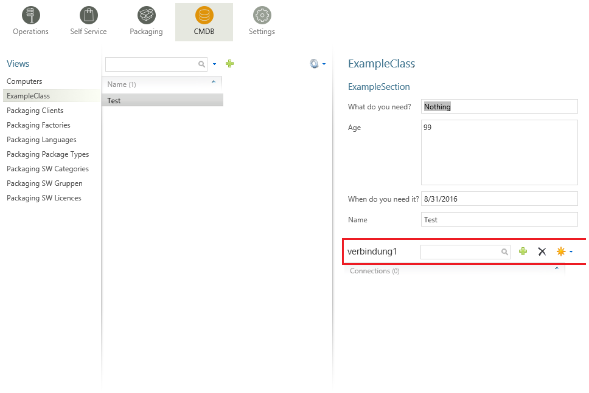
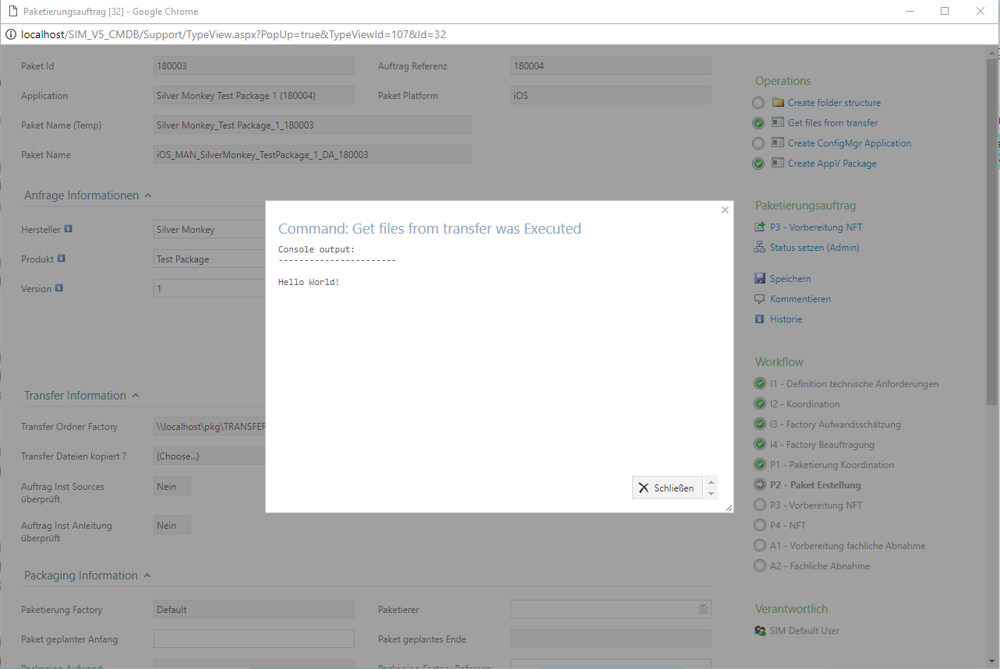

General Configuration
=============================================================

.. warning:: This article is under construction! Please DO NOT use any of the instructions below, yet!
             You may cause damage to your system. This article will be finished soon.

.. contents:: *In this article:*
  :local:
  :depth: 3

****************************************************************
Roles
****************************************************************
Create roles to limit the permissions of predefined users. You can either define a group as default group (every user gets this role), or define a specific link to an Active Directory group. You can set permissions to limit the users access on functions, reports, lists 
or modules.

Click the "+ New Role"-Button to create a new role: 

  .. figure:: _static/Roles.png

.. csv-table:: 
   :header: "Property","Description"
   :widths: 40,58

   "Name", "The general name of the role."
   "Description", "The role description."
   "AD Group", "Here you can define an LDAP Path to an AD Group. All Users of the AD Group will get the configured role."
   "E-Mail", "Depricated."
   "Default Group", "If you choose this option every user will get this role."
   "Show functions", "Enables the user to see the functions tab in the main menue."
   "Show Shop", "Enables the role to see the software shop."
   "Show CMDB", "Enables the role to see the CMDB module."
   "Show packaging", "Enables the role to see the packaging tab."
   "Show reports", "Enables the role to see the reports module."
   "Show management", "Enables the role to see the management module."
   "Edit settings", "Enables the role to edit the settings of the SIM instance. Only an option for administrators."
   "Shop Administrator", "Enables the role to edit requests in the software shop. "
   "Proces admin", "Enables the role to use the set status function."

.. _General-Configuration-Sites:

****************************************************************
Sites
****************************************************************

Create a new site via the "+ New site"-Button to connect the Packaging Module to your SCCM Site/SCCM database:

  .. figure:: _static/GeneralSiteConfiguration.png

================================================================
Common Settings
================================================================

.. csv-table:: 
   :header: "Property","Description"
   :widths: 40,58

   "Name - de", "Displayed German name of the site."
   "Name - en", "Displayed English name of the site."
   "Description - de", "German site description."
   "Description - en", "English site description."
   "Site code", "The site code of your SCCM Site. (The site code has to be unique to one site)."
   "SCCM Server", "Hostname of the SCCM Server."
   "Domain", "Domain of the SCCM service account."
   "Domain account", "Name of the sccm service account. This account is used for all functions. (specify without domain) To see which permissions this accounts needs please see the reference at the end of this subsection."
   "Domain password", "Password of the SCCM service account."
   "Impersonation", "You have to choose this option if the installation is directly on the SCCM server."

================================================================
Database settings
================================================================

.. csv-table:: 
   :header: "Property","Description"
   :widths: 40,58

   "Database server", "Specify the SCCM SQL database server. (IP adress or FQDN)"
   "Database name", "Name of the SCCM SQL database."
   "Authentication", "Choose the type of database authetication: SQL or Windows authentication. If you choose Windows authentication the domain account specified in the common settings will be used."
   "SQl user", "Name of the SCCM SQL database service account (if you chose SQL authentication)."
   "Name - en", "Password of the SCCM SQL database service account (if you chose SQL authentication)."

================================================================
Function Settings
================================================================

.. csv-table:: 
   :header: "Property","Description"
   :widths: 40,58

   "Package displayname", "Defines how SIM displays the package displayname in an SQL syntax. (e.g. Manufacturer+''+Name+''+Version+''+Language)."
   "Package filter", "Defines an SQL based fitler for the displaying of the packages in the Operations Module."
   "Computer filter", "Defines an SQL based fitler for the displaying of the computers in the Operations Module."
   "User filter", "Defindes an SQL based fitler for the displaying of the users in the Operations Module."
   "Application filter", "Defines an SQL based filter for the displaying of the applications in the Operations Module."
   "Comp.software.query", "SQl Query that is used to detemine the software that is installed on a computer."
   "Comp.app.query", "SQl Query that is used to detemine the applications that are installed on a computer."
   "Coll. group tag", "Documentation pending!"
   "Depl. role tag", "Documentation pending!"
   "Package archive tag", "Documentation pending!"
   "Default program", "Documentation pending!"
   "Pkg.var. name", "Documentation pending!"
   "Pkg.var. value", "Documentation pending!"
   "Pkg.var. locale", "Documentation pending!"
   "App.var. name", "Documentation pending!"
   "App.var. value", "Documentation pending!"
   "App.var locale", "Documentation pending!"
   "No OS check on deployments", "Documentation pending!"
   "Software from variables in prozesses", "Documentation pending!"

================================================================
Computer Software Deployment
================================================================

.. csv-table:: 
   :header: "Property","Description"
   :widths: 40,58

   "Parent folder", "Folder that acts as a container for all dynamically generated Distribution-Collections (SCCM 2012 only) for computers."
   "Limited Collection", "Collection that acts as a container for all dynamically generated Distribution-Collections (SCCM 2012 only) for computers."
   "Coll.name rule", "Naming rule for the creation of new dynamically generated advertisements for computers. You can use the follwing fields as Placeholders : ""{PackageName}"", ""{ProgramName}"",""{AdvertisementType}"",""{OfferType }"" and also all fields of the ""SMSPackage""-table in the SCCM   database. Example: ""CMP PackageName ProgramName AdvertisementType OfferType"""
   "Advert.name rule", "Specify an optional folder for the creation of dynamically generated advertisements for computers."

================================================================
User Software Deployment
================================================================

.. csv-table:: 
   :header: "Property","Description"
   :widths: 40,57

   "Parent folder", "Folder that acts as a container for all dynamically generated Distribution-Collections (SCCM 2012 only) for users."
   "Limited Collection", "Collection that acts as a container for all dynamically generated Distribution-Collections (SCCM 2012 only) for users."
   "Coll.name rule", "Naming rule for the creation of new dynamically generated advertisements for users. You can use the follwing fields as Placeholders : ""{PackageName}"", ""{ProgramName}"",""{AdvertisementType}"",""{OfferType }"" and also all fields of the ""SMSPackage""-table in the SCCM database. Example: ""CMP PackageName ProgramName AdvertisementType OfferType"""
   "Advert.name rule", "Specify an optional folder for the creation of dynamically generated advertisements for users."

****************************************************************
E-Mails
****************************************************************

Configure mails for workflows or forms here.

================================================================
Email-Group
================================================================

.. csv-table:: 
   :header: "Property","Description"
   :widths: 40,57

   "Name - de", "German name for the email-group"
   "Name - en", "English name for the email-group"

================================================================
Email
================================================================

  .. figure:: _static/Email_general.png

------------------
Condition
------------------

Define a condition that decides wheather the email should be sent or not. If this is left empty, the email will always be sent. Concatenate rules by using "AND". The following operators are avalible in the condition field:

.. csv-table:: 
   :header: "Operator","Description"
   :widths: 40,57

   "=", "equals"
   "<", "less than"
   ">", "more than"
   "!", "does not equal"
   "{roles} # Software Change Manager ", """roles"" contains the inserted Software Change Manager (case sensitive)"
   "{roles} ^ Treon User", """roles"" does NOT contain the inserted Treon User (case sensitive)"

.. Note:: The last two operators are role filters and will ONLY be working on {roles}!

Furthermore, you can use palceholders that reference to attributes of the associated workflow as seen in the following example: 

  .. code-block:: xml
    :linenos:

    {Manufacturer}=Adobe AND {Product}!Reader

In this case, the email will be sent if the Workflow parameter "Manufacturer" is filled with the value "Adobe" and the parameter "Product" does not equal "Reader".

------------------
Recipient
------------------

Defines the recipient of the email. You can specify a concrete adresse such as "support@silvermonkey.net" or use different placeholders:

.. csv-table:: 
   :header: "Property","Description"
   :widths: 40,57

   "{TicketResponsible}", "Takes the value of the specified attribute in the workflow context."
   "{$MAIL>IssueEditor}", "Takes the email adress of the specified Active Directory field in the workflow context."
   "{@OBJ.PartnerResponsiblePerson.Email}", "Takes an entry out of another table/class that is connected to the main class and Workflow context. Syntax: {@OBJ.Table.Column} "

Example:

  .. code-block:: xml
    :linenos:

    {@OBJ.PartnerResponsiblePerson.Email}

Seperate multiple recipients with a semicolon.

------------------
Subject
------------------

The subject in the email. You can use the same placeholders as you do in the recipient.

Example: 

  .. code-block:: xml
    :linenos:

    Your request was cancelled {RequestManufacturerName}_{RequestProductName}_{RequestProductVersion}_{@OBJ.PackageLanguage.CodeISO6391}_{Architecture}_{@OBJ.PackageType.Character}{PackageID}

------------------
Message
------------------

The message of the email. You can use the same placeholders as you do in the recipient.

Example: 

  .. code-block:: xml
    :linenos:

    
    The software package: {RequestManufacturerName}_{RequestProductName}_{RequestProductVersion}_{@OBJ.PackageLanguage.CodeISO6391}_{Architecture}_{@OBJ.PackageType.Character}{PackageID} was canceled.
     
      
     Rejection Reason: {Rejectionreason}
     
      If you are missing any information please look up the history of the request or get in 
      contact with the Software Change Manager.
     
      For more details about the package see packaging factory:  click <a href="{@OBJ.PackagingClient.TreonURL}/Support/TypeView.aspx?PopUp=true&TypeViewId=46&Id={Id}">this link</a>
    

****************************************************************
Workflows
****************************************************************

Configure workflows for the CMDB and the packaging process.

.. csv-table:: 
   :header: "Property","Description"
   :widths: 40,57

   "Name - de", "German name of the workflow."
   "Name - en", "English name of the workflow."

================================================================
Status
================================================================

.. note:: Change the position of a status with the green arrows in the status definition. 

.. csv-table:: 
   :header: "Property","Description"
   :widths: 40,57
   
   "Name - de", "German name of the Status."
   "Name - en", "English name of the Status."
   "Token", "Define the roles that have the permission to edit Forms in this Status. You can define multiple roles seperated with a semicolon."
   "Plausibility", "Define a condition that decides wheather or not the buttons to proceed to this status will be displayed. See the Condition Section in the previous chapter for more details."
   "Only visible when status is active", "Enable this option to hide the status in the form until the form has reached this status. (Usefull for rejected status)"

------------------
Follower
------------------

.. csv-table:: 
   :header: "Property","Description"
   :widths: 40,57

   "Follower", "Choose another workflow status as follower."
   "Function text - de", "German label text of the button to change the status to the one specified in the follower field. If you enter nothing the label of the targetet workflow status will be displayed."
   "Function text - en", "English Label Text of the button to change the status to the one specified in the follower field. If you enter nothing the label of the targetet workflow status will be displayed."
   "Message - de", "Define the german text of the message box that will be displayed when the status is changed to the follower."
   "Message - en", "Define the english text of the message box that will be displayed when the status is changed to the follower."
   "E-mail group", "Choose an email group that will be triggerd when the status is changed to the follower. This has the advantage that conditions from the email group are enabled (See the previos chapter for details regarding emails)."
   "E-Mail recipient", "Manually choose an email recipient. (See the previos chapter for details). "
   "E-Mail subject", "Manually choose an email subject. (See the previos chapter for details). "
   "E-Mail message", "Manually choose an email message. (See the previos chapter for details). "
   "Reject", "Choosing this option changes the appearance of the follower-button and creates a popup that will appear when the button is clicked."

****************************************************************
Interfaces
****************************************************************

The interfaces provide a simple and efficient way to fill or to equalize the SIM  database with data from SCCM or other databases. This is done best by using the SQL Merge command. Unless the databases are not on the same Microsoft SQL Server, the source server has to be made familiar to the SIM database server via a linkserver:

  .. figure:: _static/linkserver1.png

  
  .. figure:: _static/linkserver2.png

  Example of the adjustment of computer objects from SCCM into SIM database. New computers are automatically created, existing ones are updated and obsolete ones are deleted in SIM:

  .. code-block:: sql
    :linenos:

    MERGE treonV5.dbo.Computer AS t
    USING (
          SELECT ResourceID, Name0
          FROM   [SCCM_Servername].SMS_P01.dbo.v_R_System
          WHERE  ISNULL(Obsolete0,0) = 0
    ) AS s
    ON s.ResourceId = t.ItemKey

    WHEN MATCHED THEN
          UPDATE SET t.ItemKey = s.ResourceId,
                     t.Name = s.Name0,
                     t.SysDisplayName = s.Name0

    WHEN NOT MATCHED THEN
          INSERT ( ItemKey,
                   Name,
                   SysDisplayName )
          VALUES ( s.ResourceId,
                   s.Name0,
                   s.Name0 )

    WHEN NOT MATCHED BY SOURCE THEN
            DELETE;

  Example of the adjustment of software objects from SCCM into SIM database. New packages are automatically created, existing ones are updated and obsolete ones are deleted in SIM:

  .. code-block:: sql
    :linenos:

    MERGE treonV5.dbo.Software AS t
    USING (
          SELECT PkgId, Name, Version, Language, Manufacturer
          FROM   [SCCM_Servername].SMS_P01.dbo.SMSPackages
          WHERE  PackageType=0
    ) AS s
    ON s.PkgId = t.PkgId COLLATE Latin1_General_CI_AS

    WHEN MATCHED THEN
          UPDATE SET t.Manufacturer = s.Manufacturer,
                     t.Product = s.Name,
                     t.Version = s.Version,
                     t.Language = s.Language,
                     t.PkgId = s.PkgId,
                     t.SysDisplayName = s.Manufacturer + ' ' + s.Name + ' ' + s.Version

    WHEN NOT MATCHED THEN
          INSERT ( Manufacturer,
                   Product,
                   Version,
                   Language,
                   PkgId,
                   SysDisplayName )
          VALUES ( s.Manufacturer,
                   s.Name,
                   s.Version,
                   s.Language,
                   s.PkgId,
                   s.Manufacturer + ' ' + s.Name + ' ' + s.Version )

    WHEN NOT MATCHED BY SOURCE THEN
            DELETE;

The interfaces are accessed via the CMDB function menu or called directly via the page "Support / ExecuteInterface.aspx". A specified interface can be started right away, with the URL parameter "Interface". Several interfaces can be successively launched by lining up several interface names seperated with semicolons. This process is suitable to be called in a Windows scheduled task.

****************************************************************
Using Placeholders
****************************************************************

Placerholders are used to reference attributes in the life time execution of events (Sending emails, displaying formulars, querying databases etc.) Placeholders in XML definitions are useful in several scenarios. You can use them in the email definitions, form and list definitions and functions that use SLQ queries.

There are three main types of references:

.. csv-table:: 
   :header: "Reference Type","Description", "Example"
   :widths: 40,40,17

   "{[AttributeName]}", "References an Attribute in the current execution context.","{Name}"
   "{$[ADParameter]>[AttributeName]}", "Takes the desired part of the Active Directory Attribute that is referenced. You can use the follwing AD Parameters: [$MAIL] gives the email, [$NAME] gives the displayname,[$USERNAME] gives the username, [$ESCAPEDUSERNAME] gives the Domain + Username .","{$MAIL>Packageresponsible} "
   "{@OBJ.[Table].[AttributeName]}", "Takes an entry out of another table/class that is connected to the main class in the execution context. Syntax: {@OBJ.Table.Column} ","{@OBJ.Issue.TicketResponsible}"
   "{CURRENTUSER}", "Shows the currently logged-on user.","{CURRENTUSER}"

.. _CMDB-Form Views:

****************************************************************
Form Definition
****************************************************************

===============
Form Elements
===============

Form elements are displayed in detail forms. 

Every form element has to be definded in the XML block ``<views><view><controls>``.

.. note:: In the following sections, you will finde code-blocks filled with example code. Expressions in square brackets in the tables below are placeholders.
          Please be sure to replace the example code with specific expressions for your case if you want to copy and use xml statements from this page.
          (e.g. if you want to display a widget 300 pixels wide, change *width="250"* to *width="300" **or** replace *width="[width in px]"* with *width="300"* ).

------------------
Headline
------------------

Enter the following code to display a headline:

  .. code-block:: xml
    :linenos:
    
    <views>
    <view>
    <controls>
    <headline text="ExampleClass" />

  .. figure:: _static/Headline.PNG
     
      This is how a headline is displayed in the CMBD form.
  
------------------
Section
------------------

Define a section as follows:

  .. code-block:: xml
    :linenos:

    <views>
    <view>
    <controls>
    <section text="ExampleSection" />

  .. figure:: _static/Example_Section.PNG
     
      This is how a section is displayed in the CMBD form.

------------------
Paragraph
------------------

Define a paragraph as follows:

  .. code-block:: xml
    :linenos:

    <views>
    <view>
    <controls>
    <paragraph text="This example paragraph has been created in order to test funtionality." />

  .. figure:: _static/Paragraph.PNG
      
      This is how a paragraph is displayed in the CMBD form.

------------------
Attribute
------------------

.. note:: In order to use attributes as form elements, they will have to be created first. 
          For full reference see :ref:`CMDB-Attributes`.

You can add an attribute this way:

  .. code-block:: xml
    :linenos:

    <views>
    <view>
    <controls>
    <attribute 
        field="attribute name"
        validation="*"
        readonly="false"
        width="250"
        height="50"
        setDefaultOnLoad="Name1"
        forceDefault="false"
        Comment="This is a comment."
    />

  .. figure:: _static/Attribute.PNG
       
        This is how attributes are displayed in the CMBD form.

.. csv-table:: 
   :header: "Property","Description"
   :widths: 40,58

   "field=""[string]""", "The name of the attribute according to the object definition. Optional fields can also be used. They should have a constant name."
   "validation=""*""", "Set up a validation rule (e.g. ""*"" is used to ask for obligatory input). Example:
      
      .. code-block:: console
        
        validation=""*""
        validation=""required: true, regexp: /^[A-Za-z\d]+$/i""
        validation=""required: true, regexp: /^[A-Za-z\d]{2,20}$/i""
        
    Also available for Action buttons. The following resource keys (resource.xml) for Warning Messages Customization are given: uncompleted[Action Button] (i.e. uncompletedCopyFiles, uncompletedCMDB2SCCM, uncompletedExecute, uncompletedCreateActiveDirectory and so on)."
    "readonly=""[true|false]""", "Distinguishes between reading mode and writing mode. Type in ""true"" for reading mode or ""false"" if you want to enable the user to enter text."
    "width=""[width in px]""", "Width of the widget given in pixels."
    "height=""[height in px]""", "Height of the widget given in pixels."
    "setDefaultOnLoad=""[true|false]""", "Defines the default value for an empty attribute that is set when the form is loading."
    "forceDefault=""[true|false]""", "Forces implementation of the default values."
    "Comment=""[strings]""", "Add a comment to the attribute. It will be displayed when the curser is moved to the ""*"" at the end of the attribute."

------------------
Comment
------------------

You can add comments to an object in the XML file that will not be displayed when it is executed.

    .. code-block:: xml
      :linenos:

      <views>
      <view>
      <controls>
      <comment text="[Example Comment.]" />

------------------
Connections
------------------
These are connections to objects. It is possible to set up new connections or new objects.
Add connections using the following xml statement:

    .. code-block:: xml 
      :linenos:

      <views>
      <view>
      <controls>
      <connections
        width="385"
        height="200"
        id="connection1"
        title="ConnectionServer"
        filter="Software"
        link="true"
        create="view1; view2"
        readOnly="true"
      />

.. csv-table:: 
    :header: "Property","Description"
    :widths: 40,60

    "width=""[width in px]""", "Displayed width in pixels."
    "height=""[height in px]""", "Displayed height in pixels."
    "id=""[string/integer]""", "Unique label if multiple connection lists are displayed."
    "title=""[string]""", "Individual title for the connection list."
    "filter=""[type]""", "Restricts the connection list to one single object type."
    "link=""[true|false]""", "Enables opening referenced objects."
    "create=""[viewX]""", "List of object views which is supposed to be displayed when new objects are being set up and assigned."
    "readOnly=""[true|false]""", "Prevents user from setting up new connecitons if set to ""true""."

    
           This is how a connection is displayed in the CMBD form.

.. VORERST GESTRICHEN WEGEN OBSOLETHEIT.
.. ------------------
.. Link
.. ------------------
.. Include an HTML-link by using the following xml statement:

..   .. code-block:: xml
      :linenos:

..      <views>
      <view>
      <controls>
      <link
        url="http:://www.examplewebsite.com"
        label="Label1"
        icon="Name"
      />

.. .. csv-table:: 
   :header: "Property","Description"
   :widths: 40,60
  "url=""[reference]""", "Link or reference."
   "label=""[string]""", "Title of the reference (usually, the title should automatically be located)."
   "icon=""[string]""", "Name of the icon."
  
------------------
List
------------------
Display entrys of another class (e.g. table). It is possible to use placeholders for attributes in this statement.

Example:

 .. code-block:: xml
  :linenos:

   <list 
   id="Resources1"
   width="1200"
   title="Computer Titel"
   fields="Name,200~MACAdress,100~Language,898"
   count="SELECT count([id])
   FROM Computers"
   data="
   WITH myBase AS (
   SELECT [Id] ,
   [Name] ,
   [MACAddress] ,
   [Language] ,
   ROW_NUMBER() OVER (
   ORDER BY {order1}) AS POS
   FROM Computers
            

   )

   SELECT Id, Name, MACAddress, Language
   FROM myBase
   WHERE POS BETWEEN {start} AND {end}
   ORDER BY {order2} DESC
   
   "
   order1="Name~MACAddress~Language"
   order2="Name~MACAddress~Language"
   view="Computers Details" 
   cmd="javascript: try {window.parent.gridTable.clearSelection();} catch (e){} try {window.opener.gridTable.clearSelection();} catch (e){} document.location.href='TypeView.aspx?PopUp=true&amp;TypeViewId={view}&amp;Id='+id"
   />

 .. csv-table:: 
   :header: "Property","Description"
   :widths: 40,60

   "id=”[string/integer]”", "Unique label if multiple lists are used in a single formular definition."
   "width=”[width in px]”", "Overall width of the list in pixels."
   "title=""[string]""", "Individual title for the list."
   "fields=""[SQLColumn~ColumnWidth,SQLColumn2~ColumnWidth2...]", "Used to determine the width of the columns in the list."
   "count=""[SQLStatementwithCountresult]""", "Used to display the number of entrys in the list."
   "data=""[SQLStatement]""", "The actual query that gets the data for the list."
   "order1=""[SQLColumn~SQLColumn2...]""", "Used to determine the order in wich the sql result will be displayed."
   "order2=""[SQLColumn2~SQLColumn...]""", "Alternative to order 1 that is also use to to determine the order in wich the sql result will be displayed."
   "view=""[ViewOfthereferencedClass]""", "Enables the option to open entrys of other classes via click on the list element. This defines the View that is used to display the data."
   "cmd=""javascript: try {window.parent.gridTable.clearSelection();} catch (e){} try {window.opener.gridTable.clearSelection();} catch (e){} document.location.href='TypeView.aspx?PopUp=true&amp;TypeViewId={view}&amp;Id='+id""", "Used for the opening of other classes."

===============
Action Buttons
===============

Action buttons are buttons in detail forms. When a user has writing permission for the specific step he / she can click on that button. Action buttons are displayed on the right side of every detail form as the following image shows: 

  .. image:: _static/ActionButtonsOverview.png

Every action button has to be definded within a view in the XML block ``<views><view><controls>``. Please see the following example:

.. literalinclude:: _static/ViewExample.xml
    :language: xml
    :linenos:
    :emphasize-lines: 6

------------------
Execute
------------------

Execution of a commandline or a script. The process will be executed in the context of the IIS application pool.
However, you can use in the script impersonation for using specific accounts.

 .. code-block:: xml 
  :linenos:

   <execute   
      title="Title of the button" 
      command="C:\windows\system32\cmd.exe"
      arguments="{Var1} {Var2} {Var3}"
      exit_1="Execution was sucessfully processed."
      exit_2="Error while execution. See log for details."
      exit_dynamic="true"
      wait="true" 
      validation="*"
   />

**Available attributes**

.. csv-table:: 
   :header: "Attribute","Description"
   :widths: 40,60

   "title=""[Resource]""", "Title of the button"
   "command=""[PathToExe]""", "Full path to the executable file. Environment variables are not supported."
   "arguments=""[{Var1} {Var2} {Var3}]""", "Arguments passed to the executed process."
   "exit_nn=""[Resource]""", "After execution the exit code will be passed to the website. If a corresponding exit_nn parameter is set, a pop up is displayed to the user."
   "wait=""[true|false]""", "If set to true, the website waits for the execution to end."
   "validation=""*""", "Validation rule. If the validation rule is activated, you have to execute this Operation in order to proceed to the next workflow step."

.. warning:: If "wait" is set to "true" be aware that the internet browser and the IIS session itself both have an IDLE timeout. Only use wait="true" if the script is executed within seconds.  

**Examples:**

1. Executing a batch file

 .. code-block:: xml 
  :linenos:

   <execute   
      title="My CMD Script" 
      command="C:\windows\system32\cmd.exe"
      arguments="/C C:\SilverMonkey\Scripts\MyFirstscript.cmd {ID}"
      wait="false" 
   />

.. note:: You can also execute scripts from a network path. Make sure that the IIS Application Pool is configured to use a specific service account (default is LOCALSYSTEM).

.. code-block:: xml 
  :linenos:

   <execute   
      title="My CMD Script" 
      command="C:\windows\system32\cmd.exe"
      arguments="/C \\networkpath\share\scripts\myscript.cmd {ID}"
      wait="false" 
   />

2. Executing a powershell PS1 script

.. code-block:: xml 
  :linenos:

   <execute   
      title="My PS1 Script" 
      command="C:\Windows\system32\WindowsPowerShell\v1.0\powershell.exe"
      arguments="C:\SilverMonkey\Scripts\MyFirstscript.ps1 -PackagingJobId {ID} -OtherParam &quot;{Var1}&quot;"
      wait="false" 
   />
   
   
3. Executing a powershell PS1 script with dynamic output

.. code-block:: xml 
  :linenos:

   <execute   
      title="My PS1 Script" 
      command="C:\Windows\system32\WindowsPowerShell\v1.0\powershell.exe"
      arguments="{APPPATH}\Tools\TestScript.ps1 -PackagingJobId {ID} -OtherParam &quot;{Var1}&quot;"
      wait="true" 
      exit_dynamic="true"
      
   />

**Checklist: My execute is not running my Power Shell script.**

#. Did you set the executionpolicy on the system that is running the PS Script? (32/64 bit? use "get-executionpolicy -list" to display the present configuration)
#. Is the Identity that is defined in the IIS AppPool able to execute the specified script? (Check in the Identity property of the AppPool of your app)
#. Is the needed Power Shell version availible on your AppServer? ( Run $PSVersionTable.PsVersion in PoweShell and check)
#. Did you get the PS Script from the online share? Check if the script and its dependency's are 'unblocked'.(They will get a flag when they are downloaded that prevents them from beeing executed)
#. Double Check your XML in the form xml 
#. Try to use dynamic output (See above example 3.) to get error output displayed in frontend

.. tip:: Using quations within XML attributes: *&quot;{Var1}&quot;* (HTML notation).

------------------
ExecutePS
------------------

.. warning:: This function is deprecated because it only supports powershell up to version 2.0 and does not support cmdlets.

.. code-block:: xml 
  :linenos:

   <executePS   
      title="My PS1 Script" 
      command="C:\SilverMonkey\Scripts\MyFirstscript.ps1"
      arguments="[-PackagingJobId {ID} -OtherParam &quot;{Var1}&quot;]"
      wait="false" 
   />

.. note::  The "return" command gives back a value from the PowerShell script to the form. In the example, the value "PSVarialbe $ComputerSID" is given back to the field "ComputerSID" in the current class.
          ``return "ComputerSID = “+"'"+$ComputerSID+"'"``

.. csv-table:: 
   :header: "Attribute","Description"
   :widths: 40,60

   "title=""[string]""", "Text in the head of the function."
   "command=""[command line]""", "Command line (solved against the corresponding data record."
   "arguments=""[string]""", "Arguments that call the command (solved against the corresponding data record). If arguments are supposed to be given to the PS script, put a hyphen before the value that you want to forward."
   "wait=""[true|false]""", "Waits for the execution to stop (in case of synchronous execution). Only if this value is set to ""true"" the system can send a report to the user."
   "validation=""*""", "Validation rule. If the validation rule is activated, you have to execute this Operation in order to proceed to the next workflow step."

.. _`CMDB-actions-CMDB2SCCM`:

------------------
CMDB2SCCM
------------------

Creates or edits one or more computer objects in Microsoft ConfigMgr and performs additional actions regarding the systems:

  - Adding variables
  - Creating direct memberships for ConfigMgr Collections

The underlying code can be used in two methods:

 a) Via mass import button in lists
 b) Via action button in forms

.. note:: This action button was orignally used to fully import systems (mass import). By defining the CMDB mass import configuration to accept single systems by parameter also single systems can be imported.

- See :ref:`tut-massImport` for tutorial.
- See CMDB-SCCM-transfer_. for more information.

.. code-block:: xml 
  :linenos:

  <CMDB2SCCM   
      title="Title of button" 
      param="String"
      restart="true"
   />

**Available Attributes**

.. csv-table:: 
   :header: "Attribute","Description"
   :widths: 40,60

   "title=""[resource]""", "Title of the button"
   "param=""[string]""", "String to pass to the SQL scripts executed on runtime of the mass import."
   "restart=""[true|false]""", "If set to false, the button will be invisible when executed once."
   "validation=""*""", "Validation rule. If the validation rule is activated, you have to execute this Operation in order to proceed to the next workflow step."

**Example:**

+ Executing a batch file

.. code-block:: xml 
  :linenos:

  <CMDB2SCCM   
    title="Transfer Computer to SCCM" 
    param="SingleTransfer"
    restart="true"
  />

------------------
CopyFiles
------------------
Opens a dialogue in which new directory structures can be set for the packaging workflow. 
(Copy is carried out in context of the background SCCM account.)

  .. code-block:: xml
    :linenos:

    <views>
    <view>
    <controls>
    <copyFiles
      restart="true"
      site="Packaging site name" 
      indexFilter="true"
      indexFilterPreselected="false"
      title="Title"
      validation="*"
    />

.. csv-table:: 
   :header: "Attribute","Description"
   :widths: 40,60

   "restart=""[true/false]""", "Enables repetition of the proces after the package has been created (e.g. in order to recreate the package after manual deletion."
   "site=""[Packaging site Name]""", "Defines on which packaging site the operation will be carried out. If this attribute is not set, a parameter type ""Packetierungssite" has to contain the information needed."
   "indexFilter=""[true|false]""", "Enables the imposal of a copying restriction if multiple processes are defined."
   "indexFilterPreselected=""[true/false]""", "Enables preselection of different check boxes."
   "title=""[String]""", "Enables the possibility to change the name of the button."
   "validation=""*""", "Validation rule. If the validation rule is activated, you have to execute this Operation in order to proceed to the next workflow step."

------------------
CreatePackage
------------------
Opens a dialogue in which you can compile the SCCM package for the packaging workflow. 

  .. code-block:: xml
    :linenos:

    <views>
    <view>
    <controls>
    <createPackage
      restart="true|false"
      site="Packaging site name"
      sendToDP="true|false"
    />

 .. csv-table::
    :header: "Attribute","Description"
    :widths: 40,60

    "restart=""[true/false]""", "Enables repetition of the proces after the package has been created (e.g. in order to recreate the package after manual deletion)."
    "site=""[Packaging site Name]""", "Defines on which packaging site the operation is to be carried out. If this attribute is not set, a parameter type ""Packetierungssite"" has to contain the information needed."
    "sendToDP=""[true|false]""", "Enables transmission to Distribution Points (""DP"")."
    "validation=""*""", "Validation rule. If the validation rule is activated, you have to execute this Operation in order to proceed to the next workflow step."

------------------
CreateCollection
------------------
Opens a dialogue to create a new collection for the packaging workflow.

  .. code-block:: xml
    :linenos:

    <views>
    <view>
    <controls>
    <createCollection
      title="Ressource"
      folder="OrderId"
      parentCollection="CollectionId"
      name="Namensregel"
      collectionType="Typ"
      limitToCollectionId="CollectionId"
      query="Regelabfrage"
    />

.. csv-table:: 
   :header: "Attribute","Description"
   :widths: 40,60

   "title=""[string]""", "Text of the header of the function."
   "folder=""[string / integer]""", "Optional declaration of hte folder in which the collection is supposed to be compiled (from SCCM 2012). Note the ID of the folder - its name will not be deleted. A whole folder tree can optionally be set here. In this case, enter the ID of the folder an all folder names that should be set and connect them with a tilde. Example: 16777222~{Manufacturer}~{Product}~Install "
   "parentCollection=""[string / interger]""", "Optionally declare the collection in which the new collection is supposed to be saved (SCCM 2007)."
   "name=""[string]""", "Set a naming convention or the new collection."
   "collectionType=""[integer]""", "Collection-type key (1: user, 2: computer)."
   "limitToCollectionId=""[string]""", "Limited collection for SCCM 2012."
   "query=""[string]""", "Query for dynamic collections."
   "validation=""*""", "Validation rule. If the validation rule is activated, you have to execute this Operation in order to proceed to the next workflow step."

------------------
CreateApplication
------------------
Opens a dialogue in which you can set up the SCCM Application for the packaging workflow.

  .. code-block:: xml 
    :linenos:

    <views>
    <view>
    <controls>
    <createApplication
      restart="true|false"
      title="Resource"
      titleRestart="Resource"
      site="Packaging site name"
      configuration="Name"
    />

 .. csv-table:: 
   :header: "Attribute","Description"
   :widths: 40,60

   "restart=""[true|false]""", "Enables repetition of the proces after the package has been created (e.g. in order to recreate the package after manual deletion."
   "title=""[string]""", "Name of the resource of the action button for initial creation of the application. (The corresponding text resource has to be defined in *Ressources.xml*.)"
   "titleRestart=""[string]""", "Name of the resource of the action button for recreation of the application."
   "site=""[string]""", "Defines the packaging site where the operation has to be carried out. If this attribute is not set, the packaging job has to contain a parameter type ""packaging site"" in order to recieve the needed information."
   "configuration=""[string]""", "Name of the configuration for the application from the site settings."
   "validation=""*""", "Validation rule. If the validation rule is activated, you have to execute this Operation in order to proceed to the next workflow step."

------------------
Comment
------------------
Shows the possibility to enter a comment. All comments will be historicized.

.. code-block:: xml
  :linenos:

  <views>
  <view>
  <controls>
  <comment="This comment and will be historicized." />

------------------
Save
------------------
In order to display a save-button, enter the following XML code:

.. code-block:: xml
  :linenos:

  <views>
  <view>
  <controls>
  <save
    delete="true|false"
  />

.. csv-table:: 
   :header: "Attribute","Description"
   :widths: 40,60
   :align: center

   "delete=""[true|false]""", "Add a delete-button."
   "validation=""*""", "Validation rule. If the validation rule is activated, you have to execute this Operation in order to proceed to the next workflow step."

------------------
SendMail
------------------
Use the following XML statements in order to show a function to send preformatted Emails.

.. code-block:: xml
  :linenos:
  
  <views>
  <view>
  <controls>
  <sendMail
    title="Welcome to SIM"
    from="support@silvermonkey.net"
    to="exampleclient@example.com"
    subject="Text"
    body="Lorem ipsum dolor."
    mailGroup="AllClients"
  />

.. csv-table:: 
   :header: "Attribute","Description"
   :widths: 40,60

   "title=""[string]""", "Optionally declare a title to the button."
   "from=""[mail address]""", "Sender's mail address."
   "to=""[mail address]""", "Recipient's mail address(es)."
   "subject=""[string]""", "Subject of the email."
   "body=""[string]""", "Body of the email."
   "mailGroup=""[string]""", "Instead of adding the attributes ""to"", ""subject"" and ""body"" you can refer to a predefined group. This simplifies simultaneously sending multiple mails."
   "validation=""*""", "Validation rule. If the validation rule is activated, you have to execute this Operation in order to proceed to the next workflow step."

------------------
ImportXML
------------------

.. code-block:: xml
  :linenos:

  <views>
  <view>
  <controls>
  <importXML
    title="Resource"
    titleRestart="Resource"
  />

 
 .. csv-table:: 
   :header: "Attribute","Description"
   :widths: 40,60

   "title=""[string]""", "Resource name of the action button."
   "titleRestart=""[string]""", "Resource name of the action button which has to be used when the application is recreated (only when restart=""true""). The corresponding text resource has to be defined in Ressources.xml."
   "validation=""*""", "Validation rule. If the validation rule is activated, you have to execute this Operation in order to proceed to the next workflow step."

----------------------
CreateActiveDirectory
----------------------
Creates an active directory object. The active directory will be authenticated with the Windows login data for your *treon* database.
This is also the case if database authentication is set to "SQL". 

.. code-block:: xml
    :linenos:

    <views>
    <view>
    <controls>
    <createActiveDirectory
      title="Active D"
      parentLDAP="Ldap path"
      class="SchemaClassName"
      name="naming convention"
      attribute="value"
    />

.. note:: You will have to outcode special characters when declaring the parentLDAP. This means a backslash will have to be put in front of commas, backslashes, the rhombus sign, 
          the plus sign, angle brackets, semicolons, quotation marks and the equal sign.

.. csv-table:: 
   :header: "Attribute","Description"
   :widths: 40,60

   "title=""[string]""", "Title of the action button."
   "parentLDAP=""[LDAP path]""", "LDAP path of the container in which the object is supposed to be created."
   "class=""[string]""", "Schema class of the object that is created."
   "name=""[string]""", "Naming convention for the new object."
   "attribute=""[value]""", "All further attributes are interpreted as object attributes and connected to the first object."
   "validation=""*""", "Validation rule. If the validation rule is activated, you have to execute this Operation in order to proceed to the next workflow step."

.. _CMDB-LIst Views:

****************************************************************
List Definition
****************************************************************

You can create custom lists and customize them to fit your needs. The following subchapters describe the options you have when you are creating or customizing a list. 

===================
Properties
===================

.. csv-table:: 
   :header: "Property","Description"
   :widths: 40,80

   "Design", "Choose initially between list and form."
   "Name - de / Name - en", "The displayed name of the list"
   "Sort order", "Choose where to display the chosen list in the dropdown menu."
   "Roles", "Choose wich roles can see the list."
   "Definition", "The definition of the list."

Example List:

 .. code-block:: xml 

   <view splitterWidth="550" 
            detailView="Paketdetails PackWF" 
            newLink="" 
            viewPane="false" 
            refresh="true" 
            excelExport="true" 
            importExport="false"
            popUp="1100,800"> 

   <columns>
        <column field="ClientCode"  width="70" />
        <column field="RequestID"  width="70" />
        <column field="RequestReference"  width="70" />
        <column field="SysStatus"  width="180" />
        <column field="RequestManufacturerName"  width="200" />
        <column field="RequestProductName"  width="200" />
        <column field="RequestProductVersion"  width="100" />
        <column field="PackagingPackageName"  width="-1" />
        <column field="PackageSWGroups"  width="200" />
   </columns>

   <data>
        <condition> ({search}='' OR PackageProductName like {search} OR ClientCode like {search} OR RequestReference like {search} OR RequestID like {search}) </condition>
   </data>
   </view>

.. _CMDB-Lists-View:

======================================
   <view> Definition
======================================

**Parameters**

.. csv-table::
   :header: "View Options","Description"
   :widths: 40,80

   "splitterWidth", "Width of the splitter shown in list form. (in pixels)"
   "detailView- de / Name - en", "Specifies the form name that is to be used for the detailed representation of a list form."
   "newLink", "Construction of new objects in a list. The “detailed view“ is used as detail form."
   "viewPane", "If this value is set to “false“, the selection is displayed as a drop-down list."
   "refresh", "Displays the update function in the list view."
   "excelExport", "Displays the excel export function in the list view."
   "importExport", "Displays the import/export function in the list view."
   "popUp", "By specifying a pop-up window size in the format “width, height“ (in px), a list view opens choosen entries in a new window e.g .: “800,600“"

======================================
   <columns> Definition
======================================

Columns represent Attributes and are used to display their values in a list. You can see the syntax in the following code-block.

.. csv-table::
   :header: "Column Options","Description"
   :widths: 40,80

   "Column field", "The fieldname of the attribute to be displayed."
   "width", "Width of the column in px."

======================================
   <data> Definition
======================================

In the <data> section you can define the initial search condition for the displayed list objects. You can also define in which attributes to search.

The highlighted part in the following code block causes the website to display just the entries that posses a value like 'john doe' in the attributes IssueEditor, Requestor or qualityinspector.

 .. code-block:: xml 
   :emphasize-lines: 4

   <condition>
      ({search}='' OR IssueID like {search} OR Title like {search})
   AND 
      (IssueEditor like '%John Doe%' OR Requestor like '%John Doe%' OR qualityinspector like '%John Doe%')
   </condition>

The next highlighted part in the code block defines that the list search associated with that list will search in the attributes IssueID or Title.

 .. code-block:: xml 
   :emphasize-lines: 2

   <condition>
      ({search}='' OR IssueID like {search} OR Title like {search})
   AND 
      (IssueEditor like '%John Doe%' OR Requestor like '%John Doe%' OR qualityinspector like '%John Doe%')
   </condition>

You can define very specific filters and conditions with TSQL in lists. 

.. _CMDB-Attributes:

************************************************************************************
Attributes
************************************************************************************

**Different Types of Attributes**

You can create different types of attributes to customize the form to your needs. These attributes have different settings and functions which are described in the two tables below.

.. csv-table::
   :header: "Attribute Type","Description", "Additional Options"
   :widths: 40,40,40

   "String", "Field that holds a text.", "Default Value, Input mask"
   "Date", "Field that holds a date.", "Default Value, Number Format"
   "Integer", "Field that holds an integer.", "Default Value, Number Format"
   "Big integer", "Field that holds a big integer.", "Default Value, Number Format"
   "Float", "Field that holds a float.", "Default Value, Number Format"
   "Multilanguage Text", "-- Deprecated -- ", "-- Deprecated -- "
   "Checkbox", "Field that displays a checkbox, can have the Status 'checked' or 'unchecked'.", "Default value, Input mask"
   "Data list", "Field that holds a fixed list of entrys that can be defined in the GUI, the entrys are seperated with a semicolon ('firstentry;secondentry').", "Items, Default Value, Fill stage"
   "Config. list", "-- Deprecated --", "-- Deprecated --"
   "SQL list", "-- Deprecated --", "-- Deprecated --"
   "File", "Contains files that are stored in the SQL Database.", "Default value, Input mask"
   "Object reference", "Field that references to another table and displays the entrys defined in it.", "Object reference, Filter, Default value"
   "Active Directory User", "Field that prevents users from being registered in the Active Directory Cache (the cashe is located in the SIM DB).", "LDAP path, Default value"
   "Active Directory Group", "Field that prevents groups from being registered in the Active Directory Cashe (the cashe is located in the SIM DB).", "LDAP path, Default"
   "Packaging package name", "-- Deprecated --", "-- Deprecated --"
   "Packaging operation system", "-- Deprecated --", "-- Deprecated --"
   "Packaging site", "-- Deprecated --", "-- Deprecated --"

**Extended Attribute Functions/Options**

.. csv-table:: 
   :header: "Function","Description"
   :widths: 40,80

   "Name - de / Name - en", "The Displayname of the attribute."
   "Field name", "This is the actual column name in the SIM SQL DB."
   "Database Type", "Describes the attributes type."
   "LDAP path", "LADP path for the AD Users/Groups."
   "Auto Postback", "-- Feature not used --"
   "Suggestion", "Autocomplete. If suggestions are enabled, recent entrys will be suggested."
   "Default value","Defines a default value that will be set automatically."
   "Logical Key", "-- Feature not used --"
   "Input mask","Specifies the required format of the entry. Example: \*\*-\*\*-\*\*-\*\*-\*\*-\*\* (for MAC-Adresses) '*' is a placeholder. A valid entry would be 11-11-11-11-11-11."
   "Number format", "Defines the required format of every entry. Example: „#,##0.0“ „DD.MM.YYYY“"
   "Items", "Items of a data list seperated by semicolons. Example: Yes;No;(choose)"
   "Fill stage", "-- Feature not used --"
   "Object reference", "Used for Object reference attributes. Choose the table you want to refer to."
   "Filter", "Used for object reference attributes. Filter the entrys in the table you are referring to."
   "LDAP path", "LADP path for the AD Users/Groups."
