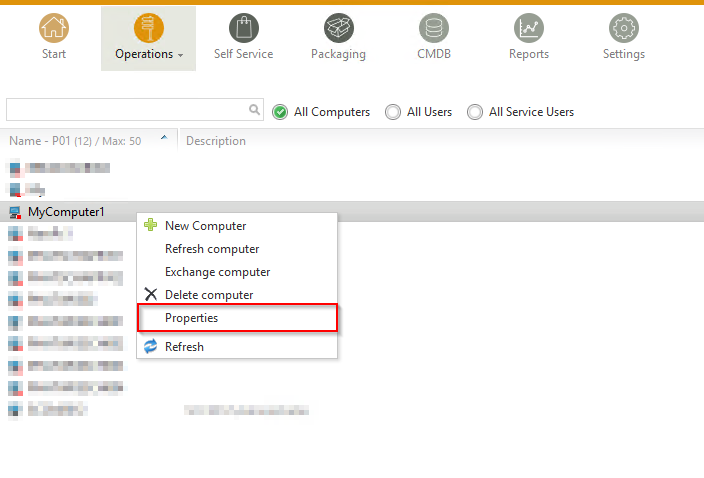
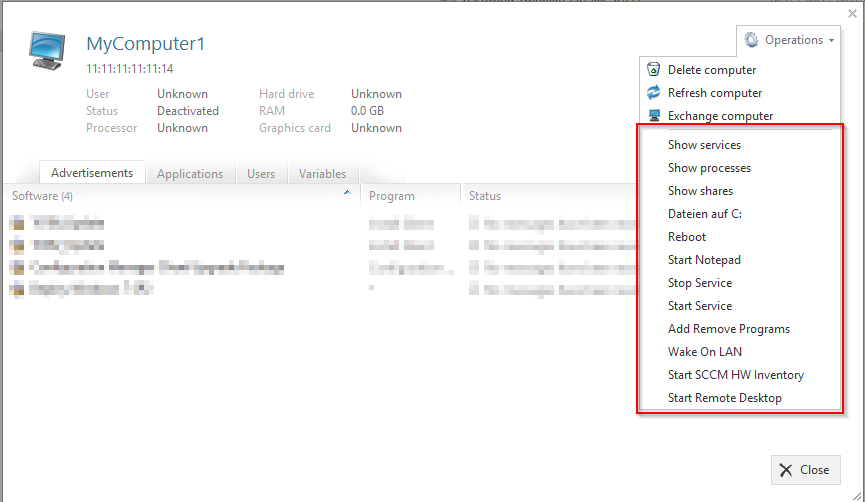

Manual for module "Operations"
=============================================================

.. contents:: *In this article:*
  :local:
  :depth: 3

.. warning:: This article is under construction! Please DO NOT use any of the instructions below, yet! You may cause damage to your system. This article will be finished soon.

************************************************************************************
Hidden settings
************************************************************************************
Hidden settings are configurable features that are not available through the standard configuration UI. 

These settings have to be set within the ``Configuration.xml`` by a text editor.

==============================
Alternate New Computer Popup
==============================

You can change the behaviour of the new computer "plus" button.
Add the following XML tag to ``//sites/site``:

.. code-block:: xml
 :linenos:

  <AlternateCreatePopup><![CDATA[javascript: functionXY();]]></AlternateCreatePopup>

**Example**

You have created a special CMDB class for computer import with the form ID ``84``. You can open a popup with the built-in javascript function ``sW``:

.. code-block:: xml
 :linenos:

  <AlternateCreatePopup><![CDATA[javascript: sW('v_84_','../Support/TypeView.aspx?PopUp=true&TypeViewId=84',650,500,true);]]></AlternateCreatePopup>

************************************************************************************
Settings
************************************************************************************

==============================
Client commands
==============================

Client commands are visible through the properties dialog in OPS module.

There are different types of client commands

**WMI query**
Executes WQL select on target machine and displays output on website.

Example: View the services the client incl. status 

.. csv-table:: 
   :header: "Setting","Value"
   :widths: 40,60

   "Type", "WMI query"
   "Namespace", "root\cimv2"
   "Query", "SELECT DisplayName, Description, StartMode, StartName, State FROM Win32_Service"

**Registry query**
Reads from target machine registry and displays output on website.

Example: View Add Remove Programs 

.. csv-table:: 
   :header: "Setting","Value"
   :widths: 40,60

   "Type", "Registry query"
   "Namespace", "HKEY_LOCAL_MACHINE"
   "Class", "SOFTWARE\Microsoft\Windows\CurrentVersion\Uninstall"
   "Query", "DisplayName, DisplayVersion, Publisher, InstallDate"

 **ClickOne**
 Executes local executables such as MSTSC for extended functionality regarding client systems.

 Example: Start MSTSC with parameter

 .. csv-table:: 
   :header: "Setting","Value"
   :widths: 40,60

   "Type", "ClickOnce"
   "Query", "../Tools/ClickOnce/SIM_Ops_Clickonce.application?{ComputerName}"

``SIM_Ops_Clickonce.application`` is delivered through latest version. You can change behaviour (executable, parameters) in config file ``Tools\ClickOnce\Application Files\SIM_Ops_Clickonce_1_0_0_0\SIM_Ops_Clickonce.exe.config.deploy``

.. tip:: If ``ClickOnce`` is missing from configuration please open Configuration.xml file and change all lines from
  ``query_wmi,WMI query;query_files,Filesystem;query_registry,Registry query;cmd_query_wmi,WMI query command;cmd_class_wmi,WMI class command;wol,WakeOnLAN`` to
  ``query_wmi,WMI query;query_files,Filesystem;query_registry,Registry query;cmd_query_wmi,WMI query command;cmd_class_wmi,WMI class command;wol,WakeOnLAN;clickonce,ClickOnce``
  
   
